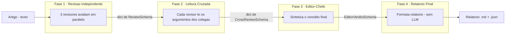

# Pipeline Multiagente Integrado — Peer Review

Repositório **integrado** onde os grupos reúnem suas contribuições para um
**pipeline multiagente em fases**. O caso de teste atual é **peer review** de
artigos científicos, mas a arquitetura foi desenhada para ser **reaproveitável em
outros domínios** (ver [§5 Extensibilidade](#5-extensibilidade)).

O sistema recebe um artigo, faz três revisores especializados avaliarem-no de
forma independente, promove uma leitura cruzada entre eles, sintetiza um veredito
editorial e emite um relatório final — sempre sob **contratos de dados validados**
(schemas Pydantic).

> Documentação técnica aprofundada dos schemas (tabelas de campos, regras de
> validação e exemplos): [`docs/schema_reference.md`](docs/schema_reference.md).

---

## 1. Visão geral

| | |
|---|---|
| **Objetivo** | Orquestrar agentes em fases sequenciais, com contratos de dados estáveis. |
| **Caso de teste** | Peer review (revisão por pares de um artigo). |
| **Contratos oficiais** | `ReviewSchema`, `CrossReviewSchema`, `EditorVerdictSchema`. |
| **Modos de execução** | **API** (Gemini real) · **Mock** (JSONs locais, offline). |
| **Saída** | Relatório final em Markdown + JSON estruturado. |

Princípio central: a **orquestração é genérica e agnóstica de domínio**
([`src/pipeline_base.py`](src/pipeline_base.py)); a **lógica de peer review**
(agentes, prompts, fases concretas) vive separada ([`src/pipeline.py`](src/pipeline.py)
e os módulos de agentes). Trocar de domínio = escrever novas fases, sem tocar na
orquestração.

### Estrutura do repositório

```
.
├── README.md                    # este arquivo
├── main.py                      # ponto de entrada: roda TODO o pipeline
├── requirements.txt             # dependências Python
├── .env.example                 # template das variáveis de ambiente (modo API)
├── docs/
│   └── schema_reference.md       # documentação técnica detalhada dos schemas
└── src/
    ├── pipeline_base.py          # Orquestração GENÉRICA (Pipeline, PipelinePhase, PipelineContext)
    ├── pipeline.py               # As 4 fases concretas + modos (API/Mock) + demo
    ├── review_schema.py          # Contratos: ReviewSchema, CrossReviewSchema, EditorVerdictSchema
    ├── reviewer_agent.py         # Fase 1 — agentes revisores
    ├── cross_review.py           # Fase 2 — leitura cruzada
    ├── editor_agent.py           # Fase 3 — editor-chefe
    ├── legacy_adapter.py         # Adaptador de formatos legados -> schemas oficiais
    ├── mocks/                    # Respostas pré-salvas para o modo offline
    │   └── peer_review_mock.json
    └── examples/                 # Artigo de exemplo + exemplos de I/O dos schemas
```

> **Para outros grupos:** a fronteira entre os grupos são os **schemas** de
> [`src/review_schema.py`](src/review_schema.py). Contribua adicionando/encaixando
> lógica nas fases (validação/retry, tools, etc.) sem quebrar esses contratos.

---

## 2. Guia de execução

> Todos os comandos são executados **a partir da raiz do repositório**.

### 2.1 Pré-requisitos

- Python 3.10+
- Dependências:

  ```bash
  pip install -r requirements.txt
  ```

  > O **modo Mock** (offline) precisa apenas de `pydantic` e `python-dotenv`.
  > O **modo API** também precisa de `google-adk` e `google-genai`.

### 2.2 Modo Local / Mock (offline, sem chave) — recomendado para testar o fluxo

Roda as 4 fases lendo respostas pré-salvas de
[`src/mocks/peer_review_mock.json`](src/mocks/peer_review_mock.json). **Não** exige
internet nem `GOOGLE_API_KEY`:

```bash
python main.py mock
```

Equivalente via variável de ambiente:

```bash
# Windows (PowerShell)
$env:PIPELINE_MODE="mock"; python main.py
# Linux / macOS
PIPELINE_MODE=mock python main.py
```

### 2.3 Modo API (chamadas reais ao Gemini)

1. Copie o template e preencha a sua chave:

   ```bash
   cp .env.example .env
   ```

   ```env
   GOOGLE_API_KEY=coloque_sua_chave_real_aqui
   GOOGLE_GENAI_USE_VERTEXAI=FALSE
   GEMINI_MODEL=gemini-2.0-flash
   ```

2. Rode a demo:

   ```bash
   python main.py          # modo api é o default
   # ou explicitamente:
   python main.py api
   ```

   Sem a chave configurada, o modo API interrompe com uma mensagem clara
   (o sistema **não** usa fallback silencioso).

### 2.4 Saídas geradas

Após rodar (em qualquer modo), em `src/outputs/` e `src/logs/` (ignorados pelo git):

| Arquivo | Conteúdo |
|---|---|
| `src/outputs/final_report.md` | Relatório final legível (decisão, síntese, críticas, recomendações). |
| `src/outputs/final_report.json` | Mesmo conteúdo em JSON estruturado, com as saídas de todas as fases. |
| `src/logs/pipeline.log` | Log fase a fase da execução. |

### 2.5 Como escolher o modo (precedência)

1. **Flag** explícita: `python main.py mock` / `run_demo(mode="mock")`;
2. **Variável de ambiente** `PIPELINE_MODE` (`api` / `mock`, com sinônimos `local`, `offline`, `real`);
3. **Default**: `api`.

---

## 3. Arquitetura do pipeline

O pipeline executa **4 fases estritamente sequenciais**. A saída de cada fase é o
**contrato de entrada** da próxima — sempre um schema validado.



### As 4 fases

| # | Fase | O que faz | Saída (contrato) |
|---|---|---|---|
| 1 | **Revisão Independente** | Três revisores (estatístico, especialista de domínio, copyeditor) avaliam o artigo **isoladamente**, em 4 critérios + nota geral + confiança. | `dict[id, ReviewSchema]` |
| 2 | **Leitura Cruzada** | Cada revisor lê os **argumentos** (não as notas) dos colegas e decide manter ou revisar a sua posição, de forma rastreável. | `dict[id, CrossReviewSchema]` |
| 3 | **Editor-Chefe** | Sintetiza os pareceres finais em uma **decisão editorial única**, preservando todas as críticas. | `EditorVerdictSchema` |
| 4 | **Relatório Final** | Consolida tudo num relatório legível + JSON. Pura formatação, **sem LLM**. | `FinalReport` (md + dados) |

### Os schemas como contratos

Os três schemas vivem em [`src/review_schema.py`](src/review_schema.py) e são a
**única fonte de verdade** do formato de dados. Toda fase **valida** sua
entrada/saída contra eles — inclusive no modo Mock —, então um dado malformado
falha cedo e de forma explícita, em vez de se propagar silenciosamente.

- **`ReviewSchema`** (Fase 1) — parecer de um revisor: 4 critérios
  (`solidez_tecnica`, `originalidade`, `significancia`, `clareza`), cada um com
  **nota (1–4) + justificativa obrigatória**, mais `nota_geral` (1–4) e
  `confianca` (1–3). Notas fora da faixa, justificativas vazias e campos extras
  são **rejeitados**.
- **`CrossReviewSchema`** (Fase 2) — embute o parecer revisado (`ReviewSchema`) e
  registra, de forma rastreável, se houve mudança de posição (`mudou_posicao`),
  **quais** notas mudaram (`mudancas`) e **qual argumento** foi decisivo.
- **`EditorVerdictSchema`** (Fase 3) — a `decisao` usa a **mesma escala 1–4** da
  `nota_geral` (sem formato paralelo de nota), com `sintese`, `justificativa`,
  `notas_por_revisor`, `criticas` (cada fraqueza/crítica preservada) e
  `recomendacoes_aos_autores`.

> **Sem formatos paralelos.** Escalas e vocabulários legados (ex.: notas 0–10 e
> rótulos "Accept/Minor Revision") só entram no sistema através do adaptador
> documentado [`src/legacy_adapter.py`](src/legacy_adapter.py), que converte e
> **revalida** contra os schemas oficiais.

### Camada de orquestração (genérica)

[`src/pipeline_base.py`](src/pipeline_base.py) não conhece peer review. Ele fornece:

- `PipelinePhase[TIn, TOut]` — fase tipada (contrato entrada→saída explícito);
- `Pipeline` — encadeia fases, propaga a saída de uma para a próxima e acumula
  todos os artefatos;
- `PipelineContext` — carrega a entrada original e as saídas já produzidas, para
  que fases posteriores (ex.: o relatório) consultem fases anteriores.

---

## 4. Mocks atuais (o que ainda está mockado)

Seção transparente sobre o que **não** é "real" hoje:

| Item | Situação |
|---|---|
| **Fases 1–3 no modo Mock** | Lidas de [`src/mocks/peer_review_mock.json`](src/mocks/peer_review_mock.json). No modo API, são chamadas reais ao Gemini. |
| **Fase 4 (relatório)** | **Nunca** mockada — é pura formatação em Python, idêntica nos dois modos. |
| **Entrada do artigo** | Usa um `.txt` de exemplo ([`src/examples/example_article.txt`](src/examples/example_article.txt)). **Ainda não há** ingestão/parse de PDF. |
| **Validação & retry** | **Pendente** de integração. Hoje a validação é a do Pydantic na fronteira de cada fase; não há política de retry automático. |
| **Tools principais** | **Pendentes** de integração — os agentes ainda não usam ferramentas externas. |
| **Adaptação de pareceres legados de revisor** | O [`src/legacy_adapter.py`](src/legacy_adapter.py) converte o **veredito do editor** legado; o parecer **de revisor** legado não tem as 4 dimensões e, por isso, **não** é adaptado automaticamente (exige nova revisão — limitação documentada). |

> O conteúdo do JSON de mock é **fictício**, porém **válido** contra os schemas —
> incluindo um caso realista em que o `domain_expert` muda de posição na leitura
> cruzada. Isso garante que o fluxo offline exercite os mesmos contratos do fluxo
> real.

---

## 5. Extensibilidade

A separação **orquestração × domínio** permite reusar a mesma arquitetura de 4
fases em outros problemas multiagentes. A receita conceitual:

1. **Defina os contratos do novo domínio.** Crie schemas Pydantic análogos aos
   três atuais — um por fase. Eles são o "idioma" que as fases falam entre si.
2. **Implemente as fases concretas.** Para cada fase, escreva uma subclasse de
   `PipelinePhase[Entrada, Saída]` que produz/valida o schema correspondente. A
   lógica interna (quais agentes/prompts/ferramentas usar) é livre.
3. **Monte o pipeline.** Liste as fases na ordem desejada num `Pipeline(...)`. A
   orquestração, o encadeamento e a propagação de contexto já vêm prontos de
   [`src/pipeline_base.py`](src/pipeline_base.py) — **sem alterações**.
4. **Reaproveite o modo Mock.** O mesmo padrão de "ler JSON pré-salvo e validar
   pelo schema" dá a você execução offline desde o primeiro dia.

### Exemplos de outros domínios

A estrutura "**múltiplos pareceres independentes → reconciliação → decisão →
relatório**" é genérica. Ela se aplica, por exemplo, a:

- **Triagem de currículos**: avaliadores especializados (técnico, cultural, de
  senioridade) → reconciliação → decisão de avanço → relatório ao recrutador.
- **Moderação de conteúdo**: classificadores por política (spam, toxicidade,
  direitos autorais) → leitura cruzada → veredito de moderação → log de auditoria.
- **Diligência de relatórios financeiros**: analistas (risco, contábil,
  regulatório) → reconciliação → recomendação → memorando.
- **Avaliação de propostas/grants**: revisores por eixo (mérito, viabilidade,
  impacto) → debate → decisão de financiamento → parecer.

Em todos, **só mudam os schemas e a lógica das fases**; a espinha dorsal de
orquestração, a alternância API/Mock e o padrão de validação permanecem os
mesmos.

---

## Apêndice — comandos rápidos

```bash
# Fluxo completo offline (sem chave):
python main.py mock

# Fluxo completo com Gemini real (requer .env com GOOGLE_API_KEY):
python main.py api

# Demos isoladas de fases específicas (usam a API real):
python src/reviewer_agent.py     # apenas a Fase 1 (avaliação independente)
python src/cross_review.py       # Fase 1 + Fase 2 (leitura cruzada)
```

> As demos isoladas (`reviewer_agent.py`, `cross_review.py`) usam a API real e
> exigem `GOOGLE_API_KEY`. Para um passo a passo offline de ponta a ponta, use
> `python src/pipeline.py mock`.
