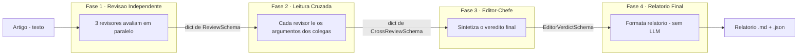

# Pipeline Multiagente Integrado — Peer Review

Repositório **integrado** onde os grupos reúnem suas contribuições para um
**pipeline multiagente em fases**. O caso de teste atual é **peer review** de
artigos científicos, mas a arquitetura foi desenhada para ser **reaproveitável em
outros domínios** (ver [§9 Extensibilidade](#9-extensibilidade)).

O sistema recebe um artigo, faz três revisores especializados avaliarem-no de
forma independente, promove uma leitura cruzada entre eles, sintetiza um veredito
editorial e emite um relatório final — sempre sob **contratos de dados validados**
(schemas Pydantic) com **retry automático** e **bloqueio explícito** de dados
inválidos entre fases.

> Documentação técnica aprofundada dos schemas (tabelas de campos, regras de
> validação e exemplos): [`docs/schema_reference.md`](docs/schema_reference.md).

---

## 1. Visão geral

| | |
|---|---|
| **Objetivo** | Orquestrar agentes em fases sequenciais, com contratos de dados estáveis. |
| **Caso de teste** | Peer review (revisão por pares de um artigo). |
| **Entrada** | **PDF real** (extraído localmente) ou artigo de exemplo em texto. |
| **Contratos oficiais** | `ReviewSchema`, `CrossReviewSchema`, `EditorVerdictSchema`, `ExtractedDocument`. |
| **Modos de execução** | **API** (provedor real) · **Mock** (JSONs locais, offline). |
| **Provedores de LLM** | **Gemini** · **Maritaca AI** · **OpenAI** — escolha única em `LLM_PROVIDER`, sem duplicar agentes. |
| **Saída** | Relatório final em Markdown + JSON estruturado, organizados por `run_id`. |

Princípio central: a **orquestração é genérica e agnóstica de domínio**
([`src/pipeline_base.py`](src/pipeline_base.py)); a **lógica de peer review**
(agentes, prompts, fases concretas) vive separada ([`src/pipeline.py`](src/pipeline.py)
e os módulos de agentes). Trocar de domínio = escrever novas fases, sem tocar na
orquestração.

### Estrutura do repositório

```
.
├── README.md                    # este arquivo
├── main.py                      # ponto de entrada: roda TODO o pipeline
├── requirements.txt             # dependências Python
├── .env.example                 # template das variáveis de ambiente (modo API)
├── docs/
│   ├── schema_reference.md       # documentação técnica detalhada dos schemas
│   └── persistencia_e_retomada.md # Grupo 1 — relatório técnico de checkpoint/retomada
└── src/
    ├── pipeline_base.py          # Orquestração GENÉRICA (Pipeline, PipelinePhase, PipelineContext)
    ├── pipeline.py               # As 4 fases concretas + modos (API/Mock) + demo
    ├── review_schema.py          # Contratos: ReviewSchema, CrossReviewSchema, EditorVerdictSchema
    ├── model_provider.py         # Escolha ÚNICA de provedor/modelo (Gemini · Maritaca · OpenAI)
    ├── reviewer_agent.py         # Fase 1 — agentes revisores
    ├── cross_review.py           # Fase 2 — leitura cruzada
    ├── editor_agent.py           # Fase 3 — editor-chefe
    ├── validacao_retry.py        # Grupo 1 — camada de validação, retry e confiabilidade (saída dos agentes)
    ├── eventos_validacao.py      # Grupo 1 — eventos estruturados (JSONL) de validação/retry
    ├── validacao_entrada.py      # Grupo 1 — validação e resiliência da ENTRADA por PDF (arquivo + texto extraído)
    ├── persistencia.py           # Grupo 1 — checkpoints por fase + estado auxiliar da execução (retomada)
    ├── demos/                    # Grupo 1 — demos offline (sem API key), separadas do código principal
    │   ├── demo_validacao.py     #   camada de validação/retry da saída dos agentes
    │   ├── demo_eventos.py       #   eventos estruturados de validação/retry
    │   ├── demo_entrada_pdf.py   #   validação da entrada por PDF (passa / alerta / retry / bloqueio)
    │   └── demo_persistencia.py  #   falha no meio -> retomada -> retomada de execução concluída
    ├── tests/
    │   ├── test_eventos_validacao.py
    │   ├── test_validacao_entrada.py
    │   ├── test_persistencia.py           # quais fases são puladas numa retomada
    │   └── test_retomada_confiavel.py     # o que SOBREVIVE à retomada (métricas, PDF, artefatos)
    ├── archive/                  # Grupo 1 — código legado sem uso ativo, arquivado (ver archive/README.md)
    │   └── legacy_adapter.py     #   adaptador de veredito legado (não importado por ninguém)
    ├── demo_observabilidade.py   # Grupo 3 — demo offline: roda o pipeline e reconstrói o trace
    ├── extraction/               # Grupo 3 — entrada real por PDF (contrato + extratores substituíveis)
    │   ├── document.py           #   contrato ExtractedDocument (id, texto, páginas, extrator, duração em s, avisos)
    │   ├── extractor.py          #   interface PdfExtractor + LiteParseExtractor (extrator padrão)
    │   └── tests/                #   testes do contrato e do extrator (PDF digital e "escaneado")
    ├── observability/            # Grupo 3 — base de observabilidade e traces
    │   ├── events.py             #   formato COMUM de evento (run_id, span_id, phase, author, status)
    │   ├── tracer.py             #   ciclo de vida da execução + spans + storage local (JSONL)
    │   ├── adk_bridge.py         #   captura os Event do ADK (invocation_id, author, tools, modelo, tokens)
    │   ├── timeline.py           #   reconstrói a linha do tempo a partir do trace
    │   └── tests/                #   testes offline do tracer (envelope, erro, ponte ADK)
    ├── tests/                    # Testes offline da seleção de provedor/modelo
    │   └── test_model_provider.py
    ├── mocks/                    # Respostas pré-salvas para o modo offline
    │   └── peer_review_mock.json
    └── examples/                 # Artigo de exemplo + exemplos de I/O dos schemas
        ├── example_article.txt
        ├── example_extracted_document.json    # ExtractedDocument válido (entrada por PDF)
        ├── example_extracted_insuficiente.json # ExtractedDocument com extração insuficiente (Grupo 1 → alerta)
        ├── example_extracted_escaneado.json   # ExtractedDocument sem texto / escaneado (Grupo 1 → retry/bloqueio)
        ├── example_valid_output.json          # ReviewSchema válido
        ├── example_invalid_output.json        # ReviewSchema inválido (viola notas e justificativas)
        ├── example_cross_review_output.json   # CrossReviewSchema válido
        ├── example_invalid_cross_review.json  # CrossReviewSchema inválido (mudou_posicao vs mudancas)
        ├── example_editor_verdict_output.json # EditorVerdictSchema válido
        └── example_invalid_editor_verdict.json # EditorVerdictSchema inválido (decisao, notas)
```

> **Para outros grupos:** a fronteira entre os grupos são os **schemas** de
> [`src/review_schema.py`](src/review_schema.py). Contribua adicionando/encaixando
> lógica nas fases (validação/retry, tools, etc.) sem quebrar esses contratos.

---

## 2. Guia de execução

> Todos os comandos são executados **a partir da raiz do repositório**.

### 2.1 Pré-requisitos

- Python 3.10+
- Dependências:

  ```bash
  pip install -r requirements.txt
  ```

  > O **modo Mock** (offline) precisa apenas de `pydantic` e `python-dotenv`.
  > O **modo API** também precisa de `google-adk` e `google-genai`; os provedores
  > **Maritaca** e **OpenAI** somam `litellm` (o Gemini não precisa dele); a
  > **entrada por PDF** precisa de `liteparse`. As versões usadas nos testes
  > desta atividade estão **fixadas** no `requirements.txt`: `google-adk==1.27.5`,
  > `google-genai==1.67.0`, `liteparse==2.6.0`, `litellm==1.82.6` e
  > `pydantic==2.13.4`.

**Por que `litellm` e `pydantic` também estão fixados (Grupo 3).** Até esta
etapa os dois ficavam soltos (`>=`), o que permite versões diferentes em cada
instalação — a causa provável do comportamento distinto entre máquinas citado
em reuniões anteriores. Cada um foi fixado por um motivo verificado, não por
escolha arbitrária:

- **`litellm==1.82.6`** — é o teto que o próprio `google-adk==1.27.5` declara
  testar (`litellm>=1.75.5,<=1.82.6`, conferido no `pyproject.toml` do release
  oficial em [google/adk-python](https://github.com/google/adk-python)) e
  também a última versão limpa antes de as versões `1.82.7`/`1.82.8` terem sido
  comprometidas num ataque à cadeia de suprimentos no PyPI (março/2026).
- **`pydantic==2.13.4`** — o `google-adk` já exige `pydantic>=2.12,<3.0` como
  dependência própria; a faixa solta (`>=2.0`) deixava o **modo mock** (que não
  instala o `google-adk`) livre para resolver uma versão bem mais antiga — e é
  esse `pydantic` que gera o `response_schema` enviado ao provedor no modo API.
- `httpx` e `openai` não ganharam linha própria: entram só transitivamente via
  `litellm`/`google-adk`, e fixar os dois acima já os prende numa faixa estreita
  e consistente.

**Verificação de instalação limpa** — reproduzível por qualquer pessoa do
grupo, sem reaproveitar nenhum ambiente já existente:

```bash
python3 -m venv /tmp/venv_limpo
/tmp/venv_limpo/bin/pip install -r requirements.txt
/tmp/venv_limpo/bin/python -m pytest src/ -q
```

Testado num ambiente sem nada herdado: resolve exatamente as versões listadas
acima e os 242 testes da suíte passam, sem nenhuma chave de API.

### 2.2 Modo Local / Mock (offline, sem chave) — recomendado para testar o fluxo

Roda as 4 fases lendo respostas pré-salvas de
[`src/mocks/peer_review_mock.json`](src/mocks/peer_review_mock.json). **Não** exige
internet nem `GOOGLE_API_KEY`:

```bash
python main.py mock
```

Equivalente via variável de ambiente:

```bash
# Windows (PowerShell)
$env:PIPELINE_MODE="mock"; python main.py
# Linux / macOS
PIPELINE_MODE=mock python main.py
```

### 2.3 Modo API (chamadas reais ao provedor escolhido)

1. Copie o template e preencha a chave do serviço que você vai usar:

   ```bash
   cp .env.example .env
   ```

   ```env
   LLM_PROVIDER=gemini
   LLM_MODEL=gemini-2.5-flash
   GOOGLE_API_KEY=coloque_sua_chave_real_aqui
   ```

2. Rode a demo:

   ```bash
   python main.py          # modo api é o default
   # ou explicitamente:
   python main.py api
   ```

   Sem a chave configurada, o modo API interrompe com uma mensagem clara
   apontando a variável do provedor selecionado (o sistema **não** usa fallback
   silencioso).

#### Escolha do provedor

Um único par de variáveis vale para **todos** os agentes — revisores, leitura
cruzada, editor-chefe e o corretor de retry. Os agentes são os mesmos objetos
`LlmAgent` do ADK em qualquer provedor: **não existe uma versão do revisor por
serviço**, e prompts, schemas, validações, traces e o modo mock não mudam.

| `LLM_PROVIDER` | Chave de API | `LLM_MODEL` padrão | Como o ADK conversa |
|---|---|---|---|
| `gemini` (default) | `GOOGLE_API_KEY` | `gemini-2.5-flash` | Rota nativa do ADK (string do modelo). |
| `maritaca` | `MARITACA_API_KEY` | `sabiazinho-4` | `LiteLlm` do ADK apontando para `https://chat.maritaca.ai/api`. |
| `openai` | `OPENAI_API_KEY` | `gpt-4o-mini` | `LiteLlm` do ADK (`openai/<modelo>`). |

```bash
# Windows (PowerShell)
$env:LLM_PROVIDER="maritaca"; python main.py api
# Linux / macOS
LLM_PROVIDER=openai LLM_MODEL=gpt-4o python main.py api
```

Detalhes e pontos de extensão: [`src/model_provider.py`](src/model_provider.py).

- **Sobrescrita por papel.** `LLM_PROVIDER_EDITOR` / `LLM_MODEL_EDITOR` trocam o
  modelo só do editor-chefe (ex.: revisores na Maritaca, síntese final no GPT-4o).
- **Structured output.** Gemini e OpenAI recebem o `output_schema` como
  `response_format: json_schema`. Na Maritaca isso vem desligado por padrão, pois
  o suporte não é documentado — o schema continua **exigido no prompt e validado**
  pelo ADK e pelo retry do Grupo 1. Para ligar: `LLM_JSON_SCHEMA=on`.
- **Compatibilidade.** Um `.env` antigo com apenas `GOOGLE_API_KEY` +
  `GEMINI_MODEL`, sem nenhuma variável `LLM_*`, continua funcionando como antes.

### 2.4 Entrada real por PDF (Grupo 3)

O pipeline aceita um **artigo real em PDF**. A extração é uma etapa
**determinística obrigatória** (fase 0) que roda ANTES dos agentes — ela não
depende de decisão de LLM — e entra na **mesma linha do tempo** (mesmo `run_id`)
das demais fases:

```bash
# Execução completa: PDF -> extração -> agentes ADK -> relatório (requer .env)
python main.py --pdf caminho/do/artigo.pdf

# Extração real do PDF + fases dos agentes com respostas mock (offline)
python main.py mock --pdf caminho/do/artigo.pdf
```

**Contrato do documento extraído** — qualquer extrator devolve um
`ExtractedDocument` ([`src/extraction/document.py`](src/extraction/document.py)),
independente de biblioteca (exemplo versionado em
[`src/examples/example_extracted_document.json`](src/examples/example_extracted_document.json)):

| Campo | Conteúdo |
|---|---|
| `document_id` | identificador estável do documento (hash do conteúdo) |
| `filename` | nome do arquivo original |
| `text` | texto extraído (alimenta os agentes) |
| `num_pages` | número de páginas |
| `extractor` / `extractor_version` | extrator utilizado e sua versão |
| `extraction_duration_s` | duração da extração em **segundos** |
| `warnings` | avisos de qualidade (ex.: PDF possivelmente escaneado) |

**Extrator substituível** — o pipeline conhece apenas a interface `PdfExtractor`
([`src/extraction/extractor.py`](src/extraction/extractor.py)). O extrator padrão é o
[LiteParse](https://pypi.org/project/liteparse/) (`liteparse==2.6.0`, local, leve);
trocá-lo no futuro = escrever outra subclasse (ou injetar via
`run_demo(extractor=...)`), **sem reescrever o pipeline**.

**Qualidade e limitações (primeira versão):**

- PDFs com **texto digital** são o caso suportado. OCR vem **desligado** por
  padrão (`LiteParseExtractor(ocr_enabled=True)` habilita, exigindo Tesseract).
- PDF **escaneado/complexo** não derruba o pipeline na extração: gera `warnings`
  no contrato e eventos de **alerta** no trace, para a camada de validação
  (Grupo 1) decidir se bloqueia ou encaminha para revisão. Se **nenhum** texto
  for extraído, a execução falha com **erro claro** (não há o que revisar).
- Baixa densidade de texto (< 200 caracteres/página, em média) também gera aviso.
- Não coloque PDFs de acesso restrito no repositório; os testes geram PDFs
  mínimos em memória.

### 2.5 Saídas geradas

Após rodar (em qualquer modo), em `src/outputs/` e `src/logs/` (ignorados pelo git).
Os artefatos de cada execução ficam em `src/outputs/<run_id>/` — uma execução
**não sobrescreve** silenciosamente a anterior:

| Arquivo | Conteúdo |
|---|---|
| `src/outputs/<run_id>/final_report.md` | Relatório final legível (decisão, síntese, críticas, recomendações), apontando para o **documento** e a **execução** que o geraram. |
| `src/outputs/<run_id>/final_report.json` | Mesmo conteúdo em JSON estruturado, com as saídas de todas as fases, os metadados do documento extraído (sem o texto completo) e o `run_id` **único** da execução (compartilhado com o trace do Grupo 3). |
| `src/outputs/<run_id>/resumo_execucao.json` | Resumo auditável de métricas da execução (Grupo 2). |
| `src/logs/pipeline.log` | Log fase a fase, em texto (orquestração + tools do Grupo 2). |
| `src/logs/validacao_events.jsonl` | Eventos estruturados de validação/retry (Grupo 1) — ver [§4](#4-validação-retry-e-confiabilidade-grupo-1). |
| `src/logs/traces/<run_id>.jsonl` | Trace de observabilidade da execução (um evento por linha), mesmo `run_id` do item acima — ver [§8 Observabilidade](#8-observabilidade-e-traces-grupo-3). |
| `src/logs/checkpoints/<run_id>/` | Checkpoint de cada fase concluída (inclui a extração do PDF), para retomar uma execução interrompida — ver [§4.2 Persistência e Retomada](#42-persistência-e-retomada-de-execuções-grupo-1). |
| `src/logs/checkpoints/<run_id>.{meta,estado}.json` | Metadados da execução (modo, PDF, se já concluiu) e o estado que a retomada precisa restaurar (métricas, auditoria). |

### 2.6 Como escolher o modo (precedência)

1. **Flag** explícita: `python main.py mock` / `run_demo(mode="mock")`;
2. **Variável de ambiente** `PIPELINE_MODE` (`api` / `mock`, com sinônimos `local`, `offline`, `real`);
3. **Default**: `api`.

---

## 3. Arquitetura do pipeline

O pipeline executa **4 fases estritamente sequenciais**. A saída de cada fase é o
**contrato de entrada** da próxima — sempre um schema validado.


```mermaid
flowchart LR
    A[Artigo - texto] --> F1
    subgraph Fase1[Fase 1 · Revisao Independente]
        F1[3 revisores avaliam em paralelo]
    end
    subgraph Fase2[Fase 2 · Leitura Cruzada]
        F2[Cada revisor le os argumentos dos colegas]
    end
    subgraph Fase3[Fase 3 · Editor-Chefe]
        F3[Sintetiza o veredito final]
    end
    subgraph Fase4[Fase 4 · Relatorio Final]
        F4[Formata relatorio - sem LLM]
    end
    F1 -->|dict de ReviewSchema| F2
    F2 -->|dict de CrossReviewSchema| F3
    F3 -->|EditorVerdictSchema| F4
    F4 --> R[Relatorio .md + .json]
```

### As 4 fases

| # | Fase | O que faz | Saída (contrato) |
|---|---|---|---|
| 1 | **Revisão Independente** | Três revisores (estatístico, especialista de domínio, copyeditor) avaliam o artigo **isoladamente**, em 4 critérios + nota geral + confiança. | `dict[id, ReviewSchema]` |
| 2 | **Leitura Cruzada** | Cada revisor lê os **argumentos** (não as notas) dos colegas e decide manter ou revisar a sua posição, de forma rastreável. | `dict[id, CrossReviewSchema]` |
| 3 | **Editor-Chefe** | Sintetiza os pareceres finais em uma **decisão editorial única**, preservando todas as críticas. | `EditorVerdictSchema` |
| 4 | **Relatório Final** | Consolida tudo num relatório legível + JSON. Pura formatação, **sem LLM**. | `FinalReport` (md + dados) |

> `run_demo(cross_review=False)` (ou `python main.py --no-cross-review`)
> desativa a Fase 2: nenhuma chamada LLM nela — cada revisor "mantém" o
> parecer da Fase 1, e a Fase 3 em diante roda sem alterações, porque
> `CrossReviewSchema` continua sendo o contrato de saída da fase, só que
> preenchido deterministicamente. É a variante experimental do benchmark de
> custo/eficiência do Grupo 2 (seção 10, "Ablação") — não o comportamento padrão.

### Os schemas como contratos

Os três schemas vivem em [`src/review_schema.py`](src/review_schema.py) e são a
**única fonte de verdade** do formato de dados. Toda fase **valida** sua
entrada/saída contra eles — inclusive no modo Mock —, então um dado malformado
falha cedo e de forma explícita, em vez de se propagar silenciosamente.

- **`ReviewSchema`** (Fase 1) — parecer de um revisor: 4 critérios
  (`solidez_tecnica`, `originalidade`, `significancia`, `clareza`), cada um com
  **nota (1–4) + justificativa obrigatória**, mais `nota_geral` (1–4) e
  `confianca` (1–3). Notas fora da faixa, justificativas vazias e campos extras
  são **rejeitados**.
- **`CrossReviewSchema`** (Fase 2) — embute o parecer revisado (`ReviewSchema`) e
  registra, de forma rastreável, se houve mudança de posição (`mudou_posicao`),
  **quais** notas mudaram (`mudancas`) e **qual argumento** foi decisivo.
- **`EditorVerdictSchema`** (Fase 3) — a `decisao` usa a **mesma escala 1–4** da
  `nota_geral` (sem formato paralelo de nota), com `sintese`, `justificativa`,
  `notas_por_revisor`, `criticas` (cada fraqueza/crítica preservada) e
  `recomendacoes_aos_autores`.

> **Sem formatos paralelos.** Escalas e vocabulários legados (ex.: notas 0–10 e
> rótulos "Accept/Minor Revision") precisam ser convertidos para os schemas
> oficiais e **revalidados**. Um adaptador de exemplo (sem uso ativo) está
> arquivado em [`src/archive/legacy_adapter.py`](src/archive/legacy_adapter.py).

### Camada de orquestração (genérica)

[`src/pipeline_base.py`](src/pipeline_base.py) não conhece peer review. Ele fornece:

- `PipelinePhase[TIn, TOut]` — fase tipada (contrato entrada→saída explícito);
- `Pipeline` — encadeia fases, propaga a saída de uma para a próxima e acumula
  todos os artefatos;
- `PipelineContext` — carrega a entrada original e as saídas já produzidas, para
  que fases posteriores (ex.: o relatório) consultem fases anteriores.

---

## 4. Validação, Retry e Confiabilidade (Grupo 1)

A camada de validação/retry foi integrada ao pipeline pelo Grupo 1. O módulo
central é [`src/validacao_retry.py`](src/validacao_retry.py).

### Como funciona

Após cada agente produzir uma saída, o pipeline chama `validar_com_tentativas()`
antes de passar o dado para a próxima fase. Essa função:

1. **Tentativa 1** — valida o dado bruto contra o schema oficial (Pydantic).
   Se passar, retorna imediatamente.
2. **Tentativas 2–N** — aplica um corrector automático e tenta validar novamente.
   Cada tentativa é registrada no histórico.
3. **Esgotamento** — se todas as tentativas falharem, levanta
   `PipelineValidationError`. O dado **nunca passa silenciosamente** para a
   próxima fase.

```
Saída bruta do agente
        |
        v
validar_com_tentativas()
  tentativa 1: schema_fn(dados)   ------> OK? retorna resultado
  tentativa 2: corrector(dados) -> schema_fn(dados)  --> OK? retorna
  tentativa 3: corrector(dados) -> schema_fn(dados)  --> OK? retorna
        |
        v  (todas falharam)
PipelineValidationError (pipeline bloqueado)
```

### Comportamento de falha definido

| Comportamento | Implementação |
|---|---|
| **Retry** | Até `MAX_TENTATIVAS = 3` vezes por agente |
| **Registro de erro** | `ResultadoValidacao.historico` — uma entrada por tentativa com status e mensagem |
| **Bloqueio** | `PipelineValidationError(RuntimeError)` — impede propagação silenciosa |
| **Marcação para revisão humana** | O chamador pode capturar `PipelineValidationError` e registrar o `ResultadoValidacao` completo para triagem manual |

### Correctors (quem conserta o dado antes do retry)

| Modo | Corrector | Descrição |
|---|---|---|
| `mock` | `corrigir_saida_mock()` | Determinístico, offline, sem API key. Clampeia notas fora do range, injeta sentinel em campos vazios/ausentes, corrige incoerências `mudou_posicao/mudancas`. |
| `api` | `corrigir_saida_api()` | Chama o **provedor escolhido** (via `model_provider.completar_texto`) com o JSON inválido + erro Pydantic + JSON Schema esperado e pede a correção. Importação lazy — não quebra o modo offline. |

### Pontos de integração no pipeline

A função `validar_com_tentativas()` substitui as chamadas diretas a
`validar_*()` nas **6 fronteiras de fase** de [`src/pipeline.py`](src/pipeline.py):

| Fase | Schema validado | Agentes cobertos |
|---|---|---|
| Fase 1 — Revisão Independente | `ReviewSchema` | `statistician`, `domain_expert`, `copyeditor` |
| Fase 2 — Leitura Cruzada | `CrossReviewSchema` | `statistician`, `domain_expert`, `copyeditor` |
| Fase 3 — Editor-Chefe | `EditorVerdictSchema` | `editor` |

### Demo offline

Roda **sem internet e sem `GOOGLE_API_KEY`**, demonstrando os 4 requisitos da spec:

```bash
python src/demos/demo_validacao.py
```

| Cenário | O que demonstra |
|---|---|
| 1 | Parecer válido (`ReviewSchema`) passando na tentativa 1 |
| 2 | Parecer inválido falhando com mensagem clara por campo |
| 3 | Retry: tentativa 1 falha, corrector mock repara, tentativa 2 passa |
| 4 | Esgotamento: `PipelineValidationError` capturada com histórico de 3 tentativas |
| 5–6 | `CrossReviewSchema` válido e inválido |
| 7–8 | `EditorVerdictSchema` válido e inválido |
| 9 | Diagrama dos 6 pontos de integração no pipeline |

### Exemplos versionados de JSON inválido

| Arquivo | Schema | Violações documentadas |
|---|---|---|
| [`example_invalid_output.json`](src/examples/example_invalid_output.json) | `ReviewSchema` | `nota=5` (acima do máximo), `justificativa` só espaços, `confianca.nota=0` |
| [`example_invalid_cross_review.json`](src/examples/example_invalid_cross_review.json) | `CrossReviewSchema` | `mudou_posicao=true` com `mudancas=[]`, `resposta_aos_pares` vazia |
| [`example_invalid_editor_verdict.json`](src/examples/example_invalid_editor_verdict.json) | `EditorVerdictSchema` | `decisao=5`, `justificativa=""`, `notas_por_revisor={}`, recomendação vazia |

### Observabilidade estruturada: eventos de validação/retry

Além do log em texto de sempre, cada tentativa de validação agora também gera
um **evento estruturado** (JSON), em [`src/eventos_validacao.py`](src/eventos_validacao.py),
respondendo diretamente à pergunta central desta parte do pipeline: *o dado
passou, falhou ou foi corrigido por quê?*

**Por que um arquivo separado (`src/logs/validacao_events.jsonl`) em vez de
escrever no `pipeline.log` que já existe:** o `pipeline.log` já é usado, no
mesmo formato de texto, pela orquestração e pelas tools do Grupo 2. Criar um
arquivo próprio, em JSON Lines (uma linha = um evento = um JSON válido), evita
disputar esse arquivo e deixa os eventos fáceis de consultar por qualquer
ferramenta (jq, grep, pandas) sem parsing heurístico de texto.

**Categorias de evento** (campo `categoria`), cobrindo os casos pedidos:

| Categoria | Quando ocorre |
|---|---|
| `passou_de_primeira` | Validou na 1ª tentativa. |
| `falhou_recuperavel` | Falhou, mas ainda há tentativas — retry a seguir. |
| `corrigido` | O corrector (mock ou API) rodou; o evento carrega o **diff** dos campos alterados (`correcao_aplicada`). |
| `passou_apos_correcao` | Validou numa tentativa ≥ 2, depois de correção. |
| `bloqueado` | Esgotaram-se as tentativas (ou o corrector falhou) — `requer_revisao_humana=True`. |

**`run_id` — agora unificado com o Grupo 3.** Antes desta integração, cada
execução gerava um `run_id` (`uuid4`) próprio, sem relação com nenhum outro
grupo. Com a base de observabilidade do Grupo 3 (`src/observability/`)
presente, `Pipeline.run()` (em `pipeline_base.py`) passa a sobrescrever
`context.run_id` pelo `tracer.run_id` assim que o contexto é criado — então o
mesmo identificador aparece em `validacao_events.jsonl`, em
`final_report.json` e no trace (`src/logs/traces/<run_id>.jsonl`). Sem o
tracer (uso isolado do Grupo 1: `demo_eventos.py`, testes, ou o pacote
`observability` ausente), o comportamento antigo continua valendo — um
`uuid4` próprio é gerado e nada quebra.

**Eventos também aparecem na timeline do Grupo 3.** `emitir_evento()` (em
`eventos_validacao.py`), além de gravar `validacao_events.jsonl` como antes,
repassa cada evento para `observability.emit_event()` — de forma guardada:
se o pacote não existir, essa chamada é um no-op silencioso, e uma falha nela
nunca derruba a validação (o evento já foi gravado no arquivo próprio antes
dessa chamada). Assim, rodando `python main.py mock` com as duas camadas
presentes, `python src/demo_observabilidade.py` mostra as tentativas, retries,
correções e bloqueios do Grupo 1 na MESMA árvore reconstruída do trace.

**Rodando a demo:**

```bash
python src/demos/demo_eventos.py
```

A demo reaproveita os cenários de sucesso, retry-com-correção e esgotamento de
`demo_validacao.py`, mas sob um único `run_id`, e ao final lê de volta o
arquivo de eventos e imprime a linha do tempo da execução — é assim que se
"abre o arquivo de eventos e entende o histórico de validação de uma
execução". Rodada isoladamente (sem o pacote `observability`), funciona
exatamente como antes da integração.

**Rodando o pipeline completo** (`python main.py mock`), os eventos de todas
as fases ficam em `src/logs/validacao_events.jsonl`, todos com o mesmo
`run_id` impresso no console ao final da execução — e, se o tracer do Grupo 3
estiver ativo, esse é também o `run_id` do trace.

**Testes:** `src/tests/test_eventos_validacao.py` cobre o diff de correção, a
validação de categorias, a leitura/filtragem por `run_id` e a sequência
completa de eventos emitidos por `validar_com_tentativas()` nos três casos
(sucesso, retry e bloqueio) — sem depender do pacote `observability` (que,
quando ausente, faz o espelhamento virar no-op).

**O que este item não faz (por escopo):** não recalcula nem substitui a
validação/retry existente, e não captura eventos internos do ADK (isso é do
Grupo 3, via `adk_bridge.py`). O identificador comum e a conexão com o trace,
que antes ficavam como proposta em aberto, já estão integrados — ver
[§8](#8-observabilidade-e-traces-grupo-3).

### 4.1 Validação e resiliência da ENTRADA por PDF

Com a entrada real por PDF (extração do Grupo 3, [§2.4](#24-entrada-real-por-pdf-grupo-3)),
a mesma filosofia de confiabilidade passa a valer **antes dos agentes**: decidir
se um documento pode seguir, precisa de nova tentativa ou deve ser bloqueado —
sem nunca aceitar em silêncio um arquivo ou texto inadequado. Isso vive em
[`src/validacao_entrada.py`](src/validacao_entrada.py) e reusa a MESMA trilha de
eventos (`validacao_events.jsonl`), o MESMO `run_id` e o MESMO espelhamento no
trace do Grupo 3 — não há segundo sistema de logs nem outro identificador.

**Duas verificações determinísticas (sem LLM):**

| Etapa | Função | Verifica |
|---|---|---|
| Antes da extração | `classificar_arquivo_pdf` | arquivo inexistente, não-arquivo, formato ≠ `.pdf`, vazio, sem cabeçalho `%PDF` (corrompido), `/Encrypt` (protegido). |
| Depois da extração | `classificar_documento_extraido` | texto vazio, muito curto (< 200 caracteres), caracteres ilegíveis (> 30%), baixa densidade por página (< 200 car./página) e avisos do extrator. |

**Política de decisão — quando seguir, alertar, retentar ou bloquear:**

| Decisão | Quando | Efeito | Categoria de evento |
|---|---|---|---|
| **OK** | arquivo e texto em condições. | Segue para os agentes. | `passou_de_primeira` |
| **ALERTA** | texto curto, ilegível, baixa densidade ou avisos do extrator. | **Segue**, marcado para revisão humana (não é silencioso). | `alerta_entrada` |
| **RETRY** | texto vazio (PDF escaneado/protegido). | Nova tentativa **só** se houver estratégia de reextração (ex.: OCR); ela é registrada como `corrigido` apenas se o texto realmente mudar. | `falhou_recuperavel` → `corrigido` → `passou_apos_correcao` |
| **BLOQUEAR** | arquivo ruim, ou texto irrecuperável sem estratégia. | Levanta `EntradaInvalidaError`; `main.py` encerra com mensagem clara e código ≠ 0. | `bloqueado` |

**Por que retry só às vezes:** repetir a leitura de um arquivo corrompido,
inexistente ou protegido nunca muda o resultado — esses casos bloqueiam de
imediato (`permite_retry=False`). Retry é reservado ao que uma nova tentativa
pode de fato resolver (texto ausente → reextrair com OCR). E uma reextração que
devolve o mesmo texto **não** é registrada como "correção" (evita marcar
correção onde os dados não mudaram).

**Integração combinada com o Grupo 3 (mínima):** o arquivo é validado em
`run_demo` antes de extrair; o documento é validado dentro de `extract_pdf_input`
logo após a extração; e a própria chamada de extração é envolvida por um
`try/except` que transforma uma falha do parser (PDF protegido por senha,
corrompido de um jeito que só o extrator detecta) em evento estruturado via
`registrar_falha_extracao` — em vez de um traceback solto. O orquestrador
`validar_entrada_com_retry` expõe o ciclo completo (arquivo → extração →
documento → retry) pronto para o Grupo 3 ligar uma estratégia de OCR quando
quiser — sem redesenhar o pipeline.

**Rodando a demo** (offline, sem PDF real — usa o contrato `ExtractedDocument`
e arquivos de fixture temporários):

```bash
python src/demos/demo_entrada_pdf.py
```

Ela apresenta os quatro casos pedidos — documento que passa, caso com alerta,
falha recuperável (reextração) e bloqueio com motivo claro — todos sob o mesmo
`run_id`, e imprime a linha do tempo lida de volta do arquivo de eventos.

**Testes:** [`src/tests/test_validacao_entrada.py`](src/tests/test_validacao_entrada.py)
cobre os checks de arquivo (fixtures em `tmp_path`), os de documento (contrato
`ExtractedDocument`), a emissão de eventos com `run_id` e os quatro cenários do
orquestrador de retry.

**Fora de escopo (dos outros grupos):** não implementamos o extrator de PDF nem
o OCR (Grupo 3), e não calculamos tokens/métricas (Grupo 2).

### 4.2 Persistência e Retomada de Execuções (Grupo 1)

Uma execução longa que falha na fase 3 não pode obrigar ninguém a refazer as
fases 1 e 2 — nem a pagar por elas de novo. O pipeline salva um **checkpoint por
fase** e, numa retomada pelo mesmo `run_id`, pula tudo que já concluiu.

> Registro técnico completo (decisões, correções, limitações):
> [`docs/persistencia_e_retomada.md`](docs/persistencia_e_retomada.md).

```bash
python main.py mock                          # anote o run_id impresso ao final
python main.py --resume run_abc123           # retoma de onde parou
python main.py --resume run_abc123 --force   # refaz do zero, sob o mesmo run_id
```

#### O que é gravado, e onde

Tudo em `src/logs/checkpoints/` (ignorado pelo git):

| Arquivo | Conteúdo |
|---|---|
| `<run_id>/fase_0_extracao_pdf.json` | O `ExtractedDocument` completo (com o texto). É o que evita re-extrair o PDF. |
| `<run_id>/fase_N_*.json` | Saída serializada de cada fase concluída (`PipelinePhase.serialize_output`). |
| `<run_id>.meta.json` | Metadados da execução: `pdf_path` e `mode` originais, `status` (`em_andamento` / `concluida`) e `concluida_em`. |
| `<run_id>.estado.json` | Estado auxiliar: eventos de métrica já coletados, tempo de parede acumulado e a auditoria do veredito. |

A separação entre as duas categorias é deliberada. `fases_concluidas()` lista os
`*.json` **de dentro** da pasta `<run_id>/`; qualquer estado guardado ali viraria
uma "fase fantasma" no resumo de falha e na retomada. Por isso o estado auxiliar
mora em *sidecars irmãos* da pasta, e não dentro dela. Toda escrita é atômica
(`.tmp` + `rename`): um processo morto no meio da gravação preserva o arquivo
anterior em vez de deixar um checkpoint truncado.

#### O que a retomada preserva (e por quê)

- **O PDF já extraído.** A fase 0 é uma fase como as outras: tem checkpoint e é
  pulada na retomada. O arquivo original **não** é revalidado — ele já passou por
  `validar_arquivo_pdf` e `validar_documento_extraido` na execução original, e
  esses eventos estão no `validacao_events.jsonl` do mesmo `run_id`. Consequência
  prática: a retomada funciona mesmo que o PDF tenha sido movido ou apagado.
- **As métricas das fases anteriores.** Uma fase restaurada não roda, logo não
  emite evento nenhum — e o `ExecutionCollector`, que nasce vazio a cada
  chamada, produzia um resumo final descrevendo só o pedaço re-executado. Agora
  os eventos salvos são devolvidos ao coletor por
  `ExecutionCollector.restaurar()`, com **timestamp e duração originais**: a
  duração que vale para uma fase é a de quando ela de fato rodou. O tempo de
  parede das tentativas anteriores também é somado, senão o resumo mostraria uma
  duração total menor que a soma das durações das fases.
- **A auditoria do veredito.** Ela nasce na fase 3 e é lida pela fase 4 via
  `context.config`. Com a fase 3 restaurada, o relatório saía com
  `auditoria_veredito: null`, sem nenhum aviso. Agora ela viaja no sidecar de
  estado.
- **Traces e eventos.** Não precisaram de código novo: o `JsonlExporter` (Grupo 3)
  e o `validacao_events.jsonl` (Grupo 1) já são *append-only*, então a retomada
  **acrescenta** ao histórico em vez de substituí-lo. O trace de um `run_id`
  retomado mostra as duas tentativas, incluindo o erro da primeira. Há um teste
  travando esse comportamento, para que ninguém o quebre sem perceber.

#### Retomar uma execução já concluída é um no-op

Se todas as fases já concluíram e os artefatos foram gravados, não há o que
retomar — e re-executar significaria regravar `final_report.md`/`.json` e
`resumo_execucao.json` por cima de artefatos completos. O pipeline imprime que a
execução já terminou, devolve o relatório existente e **não escreve nada**. Para
refazer de propósito, `--force` descarta os checkpoints e as métricas e roda tudo
de novo sob o mesmo `run_id` (as métricas precisam ir junto: mantê-las faria cada
fase ser contada duas vezes).

#### Decisões de projeto

- **Métricas são persistidas só em fronteiras de sucesso** (fase 0 extraída, cada
  fase concluída, fim da execução) — nunca no caminho de falha. Salvar os eventos
  de uma tentativa que falhou faria a retomada bem-sucedida herdar
  `quantidade_falhas` e `status_final="falha"` de um problema já resolvido. O
  rastro forense da tentativa que falhou continua no trace e no
  `validacao_events.jsonl`.
- **O gancho `on_phase_end` em `pipeline_base.py` é genérico.** A orquestração só
  chama o callback depois de gravar o checkpoint; ela não sabe o que o domínio
  persiste ali. Isso mantém checkpoint e métricas descrevendo sempre o mesmo
  ponto da execução.
- **O schema do resumo (Grupo 2) não mudou.** A correção entra pelo coletor
  (`restaurar()`, aditivo, com default que preserva o comportamento atual), não
  por `metrics/resumo.py`. A proveniência da retomada vai num bloco próprio do
  relatório, `data["retomada"]` (`execucoes`, `fases_restauradas`,
  `eventos_metricas_restaurados`).
- **Rede de segurança contra a regressão.** Antes de gravar, o pipeline confere se
  toda fase com checkpoint aparece no resumo; se alguma faltar, um alerta
  explícito entra em `resumo.alertas`. Um resumo incompleto que se denuncia é
  melhor que um que passa batido — que era exatamente o problema original.

#### Demo e testes

```bash
# Demo offline: falha na fase 3 -> retomada -> retomada de execução concluída
python src/demos/demo_persistencia.py

# Testes
python -m pytest src/tests/test_persistencia.py src/tests/test_retomada_confiavel.py -v
```

[`test_persistencia.py`](src/tests/test_persistencia.py) cobre *quais fases são
puladas*; [`test_retomada_confiavel.py`](src/tests/test_retomada_confiavel.py)
cobre *o que sobrevive* à retomada. O critério do segundo é comparativo: a
retomada tem que ser **indistinguível de uma execução que nunca falhou** — mesmas
fases no resumo, mesmo número de validações, mesmas tools, mesmo `status_final`.
Os cenários usam uma falha injetada no meio do pipeline real, em modo mock, com
`LOG_DIR`/`OUTPUT_DIR` redirecionados para `tmp_path`.

---

## 5. Tools Determinísticas de Auditoria (Grupo 2)

Tools **sem LLM** que auditam os schemas oficiais do pipeline. Vivem em
[`src/tools/`](src/tools/) e operam sobre `dict` puro, usando apenas a
biblioteca padrão — rodam offline em clone limpo.

### As três tools

| Tool | Arquivo | O que faz | Quando é chamada |
|---|---|---|---|
| `validar_completude` | [`tools/validar_completude.py`](src/tools/validar_completude.py) | Audita a **estrutura** de um parecer (`ReviewSchema`) ou veredito (`EditorVerdictSchema`): detecta campos faltando, notas fora da faixa e justificativas vazias; devolve `score_completude` (0–1). | **Fase 1** — após cada parecer de revisor ser validado pelo schema Pydantic. |
| `checar_coerencia` | [`tools/checar_coerencia.py`](src/tools/checar_coerencia.py) | Detecta **inconsistências semânticas** no veredito (ex.: `decisao=4` com notas baixas; crítica bloqueante junto de aceitação; crítica de revisor sem nota). | **Fase 3** — chamada por dentro de `auditar_decisao_final`, que herda as inconsistências detectadas. |
| `auditar_decisao_final` | [`tools/auditar_decisao_final.py`](src/tools/auditar_decisao_final.py) | Produz um **log de auditoria rastreável** do veredito do editor: agrega notas, conta críticas, herda inconsistências de `checar_coerencia` e decide `requer_revisao_humana`. | **Fase 3** — logo após o veredito ser validado, antes de passar à Fase 4. |

### Pontos de integração no pipeline

```
Fase 1 · Revisão Independente
  └─ para cada revisor: validar_completude(parecer)
        → loga score_completude e flag completo

Fase 3 · Editor-Chefe
  └─ auditar_decisao_final(veredito)
        → loga resumo_auditoria
        → avisa se requer_revisao_humana = True
        → inclui resultado em final_report.json["auditoria_veredito"]
```

As importações são **guardadas**: se um arquivo de tool ainda não existir, o
pipeline continua sem ela (registra apenas a ausência no log).

### Demo offline das tools

Roda **sem internet e sem `GOOGLE_API_KEY`**, mostrando as três tools sobre
exemplos versionados:

```bash
python src/tools/demo_tools.py
```

| Cenário | O que demonstra |
|---|---|
| 1 | `validar_completude` em parecer válido (`ReviewSchema`) — `score=1.0` |
| 2 | `validar_completude` detectando campos faltando e notas inválidas |
| 3 | `validar_completude` no veredito incompleto (`EditorVerdictSchema`) |
| 4 | `checar_coerencia` detectando 3 inconsistências simultâneas no veredito incoerente |
| 5 | `auditar_decisao_final` sobre o veredito versionado |

### Exemplos versionados de JSON para as tools

| Arquivo | Usado por |
|---|---|
| [`example_valid_output.json`](src/examples/example_valid_output.json) | `validar_completude` — parecer válido (score 1.0) |
| [`example_parecer_incompleto.json`](src/examples/example_parecer_incompleto.json) | `validar_completude` — campo faltando + notas inválidas |
| [`example_veredito_incompleto.json`](src/examples/example_veredito_incompleto.json) | `validar_completude` — veredito com sintese/notas inválidas |
| [`example_editor_verdict_output.json`](src/examples/example_editor_verdict_output.json) | `auditar_decisao_final` — veredito coerente (score ok) |
| [`example_editor_verdict_incoerente.json`](src/examples/example_editor_verdict_incoerente.json) | `checar_coerencia` / `auditar_decisao_final` — 3 inconsistências simultâneas |

### Testes

```bash
# Todos os testes das tools (33 no total, 100% passando)
.venv/bin/pytest src/tools/tests/ -v
```

---

## 6. Mocks atuais (o que ainda está mockado)

Seção transparente sobre o que **não** é "real" hoje:

| Item | Situação |
|---|---|
| **Fases 1–3 no modo Mock** | Lidas de [`src/mocks/peer_review_mock.json`](src/mocks/peer_review_mock.json). No modo API, são chamadas reais ao provedor escolhido. |
| **Fase 4 (relatório)** | **Nunca** mockada — é pura formatação em Python, idêntica nos dois modos. |
| **Entrada do artigo** | Usa um `.txt` de exemplo ([`src/examples/example_article.txt`](src/examples/example_article.txt)). **Ainda não há** ingestão/parse de PDF. |
| **Validação & retry** | **Integrado** — ver [§4](#4-validação-retry-e-confiabilidade-grupo-1). Retry automático com corrector em modo Mock (offline) e API (provedor escolhido). `PipelineValidationError` bloqueia propagação de dados inválidos. Eventos estruturados em `src/logs/validacao_events.jsonl`, com `run_id` **unificado** com o tracer do Grupo 3 quando presente, e espelhados em `observability.emit_event()` — ver [§8](#8-observabilidade-e-traces-grupo-3). |
| **Tools de auditoria** | **Integradas** — ver [§5](#5-tools-determinísticas-de-auditoria-grupo-2). `validar_completude` (Fase 1), `checar_coerencia` (chamada por dentro da Fase 3) e `auditar_decisao_final` (Fase 3) — todas ativas. |
| **Adaptação de pareceres legados de revisor** | O adaptador arquivado em [`src/archive/legacy_adapter.py`](src/archive/legacy_adapter.py) (sem uso ativo) converte o **veredito do editor** legado; o parecer **de revisor** legado não tem as 4 dimensões e, por isso, **não** é adaptado automaticamente (exige nova revisão — limitação documentada). |

> O conteúdo do JSON de mock é **fictício**, porém **válido** contra os schemas —
> incluindo um caso realista em que o `domain_expert` muda de posição na leitura
> cruzada. Isso garante que o fluxo offline exercite os mesmos contratos do fluxo
> real.

---

## 7. Métricas de Execução e Resumo Auditável (Grupo 2)

Além das três tools de auditoria (ver seção de Tools Determinísticas), o
Grupo 2 também instrumenta a EXECUÇÃO do pipeline: cada rodada gera um
conjunto de eventos estruturados e um resumo agregado, pensados para evoluir
depois para métricas ADK/OpenTelemetry sem depender de parsing de texto solto.

### O que foi adicionado

Vive em [`src/metrics/`](src/metrics/), sem dependências externas:

| Arquivo | O que é |
|---|---|
| `eventos.py` | `ExecutionEvent` — evento atômico (fase, tipo, nome, status, duração, detalhes). |
| `coletor.py` | `ExecutionCollector` — acumula eventos de uma execução; dois context managers (`fase()`, `tool()`) medem duração e registram sucesso/falha automaticamente. |
| `adk_usage.py` | Tokens reais: lê o `usage_metadata` dos `Event` do ADK (entrada, resposta, pensamento, cache, total + modelo/agente/`invocation_id`), com dedup de parciais/repetidos e o cálculo de custo (`estimar_custo_usd`) a partir de um preço. |
| `precos_modelos.py` | Resolve QUAL preço usar (`resolver_precos()`): variável de ambiente configurada manualmente vence; sem ela, tenta `litellm.model_cost` (se o pacote estiver instalado — reaproveita a tabela que ele já mantém, não cobre Maritaca); sem isso, cai numa tabela de preços OFICIAIS estática por provedor/modelo (Gemini, OpenAI, Maritaca — fontes documentadas no módulo). É o que ativa `custo_estimado` sem exigir configuração manual. |
| `resumo.py` | `gerar_resumo()` — agrega os eventos em um `ResumoExecucao`: duração total, duração por fase, nº validações/retries/falhas, tools chamadas, tokens (por agente, por fase e da execução), decisão final, status final, alertas. |
| `exportar.py` | `imprimir_resumo()` (tabela no terminal) e `salvar_resumo_json()`. |

### Como se integra ao pipeline

Importação guardada, no mesmo padrão das tools: se `src/metrics/` não
existir, o pipeline roda normalmente, sem instrumentação. Quando existe,
`run_demo()` cria um `ExecutionCollector` e o pendura em
`context.config["_metrics_collector"]` — a mesma convenção de chave "privada"
já usada por `_auditoria_veredito` e `_mock_cache`. Cada fase mede sua própria
duração com `coletor.fase(self.name)`; cada chamada de tool é medida junto do
seu evento de tool; cada validação (`validar_com_tentativas`) é traduzida em
eventos de validação/retry/falha a partir do `ResultadoValidacao` já retornado.

O resumo é montado em `run_demo()`, depois que `pipeline.run()` retorna (assim
inclui a duração da própria Fase 4). Ele é incluído em
`final_report.json["resumo_execucao"]` e também salvo separadamente em
`src/outputs/resumo_execucao.json`.

### Tokens reais (usage_metadata do ADK)

No modo API, os três loops de agente (`reviewer_agent.py`, `cross_review.py`,
`editor_agent.py`) passam cada `Event` do Runner para
`registrar_usage_adk(event, fase=...)` — ao lado do `trace_adk_event` do
Grupo 3, consumindo o MESMO stream de eventos. Cada resposta de modelo vira um
evento `chamada_llm` com os tokens do `usage_metadata` (`prompt`, `candidates`,
`thoughts`, `cached`, `total`), o modelo (`model_version`), o agente
(`author`), a fase e o `invocation_id`.

Regras importantes (detalhes e schema em
[`docs/metricas_reference.md §5`](docs/metricas_reference.md)):

- **Indisponível ≠ zero:** campo que o ADK não informou fica `null` no JSON e
  `n/d` no terminal — nunca `0`, e nunca estimado por tamanho de texto.
  Chamada sem `usage_metadata` ainda é registrada, com aviso em `alertas`.
- **Sem contagem duplicada:** parciais de streaming são ignorados (usage
  cumulativo — só a resposta final conta) e o registro deduplica por
  `event.id` (ou `invocation_id + author`).
- **Agregação:** `tokens_execucao` (categorias da execução completa),
  `tokens_por_agente` e `tokens_por_fase` (soma de `tokens_total`), além de
  `chamadas_llm` e `modelo_usado`.
- **Custo ativado.** `custo_estimado` é calculado sempre que há tokens
  medidos E um preço resolvido para a execução. O preço vem, em ordem: (1)
  `GRUPO2_PRECO_USD_MILHAO_TOKENS_ENTRADA`/`_SAIDA`, se as DUAS estiverem
  configuradas — override manual, sempre vence; (2) `litellm.model_cost`, se
  o pacote `litellm` estiver instalado (já é dependência do projeto para
  Maritaca/OpenAI — aqui só reaproveitamos a tabela de preços que ele já
  mantém, sem dependência nova; não cobre a Maritaca); (3) senão, a tabela de
  preços OFICIAIS de `metrics/precos_modelos.py`, indexada pelo
  provedor/modelo que a execução já resolveu via `model_provider`. Sem preço
  configurado e sem entrada reconhecida em nenhuma fonte, `custo_estimado`
  permanece `null` — nunca `0`. Ver
  [`docs/metricas_reference.md §5.3`](docs/metricas_reference.md).
- No modo **mock** não há chamada LLM — a seção de tokens indica isso
  explicitamente, e todos os campos ficam `null`/`n/d`.

### Fallback de LLM (troca de modelo por falha temporária)

Quando `LLM_FALLBACK_*` está configurado (ver
[`src/llm_fallback.py`](src/llm_fallback.py)), cada troca de modelo também
entra no resumo: `quantidade_fallbacks_acionados`,
`quantidade_fallbacks_respondidos`, `quantidade_fallbacks_esgotados` e a
lista `fallbacks_llm` (uma entrada por evento, com fase, papel, provedor
inicial, motivo da falha, opção fallback e qual modelo respondeu). Mesma
regra de agregação genérica das demais métricas: um fallback "esgotado"
(principal e reserva falharam) marca `status_final = "falha"`; um "acionado"
vira um item em `alertas`. Sem reserva configurada, todos os campos ficam
zerados/vazios. Detalhes completos em
[`docs/metricas_reference.md §6`](docs/metricas_reference.md).

### Exemplo de resumo gerado (modo mock)

```
==========================================================================
  RESUMO DA EXECUÇÃO — run_id=a8ffbc92-984f-4fba-9174-0add31fe98ed
==========================================================================
Status final:        sucesso
Decisão final:       3
Revisão humana:      não recomendada
Duração total:       < 0.01 s

Duração por fase:
  fase_1_revisao_independente              < 0.01 s
  fase_2_leitura_cruzada                   < 0.01 s
  fase_3_editor_chefe                      < 0.01 s
  fase_4_relatorio_final                   < 0.01 s

Validações: 7    Retries: 0    Falhas: 0

Tools chamadas:
  validar_completude                       3x
  auditar_decisao_final                    1x
  checar_coerencia                         1x

Tokens (usage_metadata do ADK):
  (nenhuma chamada LLM registrada — ex.: modo mock)

Alertas:
  (nenhum)
==========================================================================
```

Em execução real (modo API), a seção de tokens mostra chamadas LLM, modelo,
tokens da execução completa (entrada/resposta/pensamento/cache/total) e os
totais por agente e por fase — com `n/d` onde o ADK não informou o dado.

Durações são medidas em **segundos**; em modo mock as fases rodam tão rápido
que aparecem como `< 0.01 s` (ver `_fmt_s` em
[`docs/metricas_reference.md`](docs/metricas_reference.md) para a regra de
arredondamento na exibição — o JSON sempre grava o float completo).

### Como rodar

```bash
# Testes das métricas (offline, sem API key)
.venv/bin/pytest src/metrics/tests/ -v

# Pipeline completo em modo mock — imprime o resumo no final
.venv/bin/python main.py mock
cat src/outputs/resumo_execucao.json
```

### Decisões de projeto

- **Por que `context.config` e não um novo atributo em `PipelineContext`?**
  Para não alterar `pipeline_base.py` (orquestração genérica, fora do escopo
  do Grupo 2) — `config` já é usado como "estado interno de execução" por
  outras partes do sistema.
- **Por que medir a fase por dentro do `run()` de cada fase, e não com um
  hook em `Pipeline.run()`?** Porque `pipeline_base.py` não tem
  `on_phase_start`/`on_phase_end` hoje, e criar um não é responsabilidade
  desta atividade.
- **Tokens** (`tokens_totais`, `modelo_usado`, `chamadas_llm`,
  `tokens_execucao`, `tokens_por_agente`, `tokens_por_fase`) são preenchidos
  a partir do `usage_metadata` real do ADK quando há execução com um
  provedor real; `custo_estimado` é calculado a partir do preço resolvido em
  `precos_modelos.resolver_precos()` (ambiente > tabela oficial > `null`) —
  ver [`docs/metricas_reference.md §5`](docs/metricas_reference.md) e o
  caminho de evolução até OpenTelemetry.

### O que ficou fora desta etapa

- Nenhuma hierarquia de span/parent_span nem bridge com o `Runner` do ADK
  (território do Grupo 3).
- `duracao_total_s` já é tempo de parede (medido pelo `ExecutionCollector`,
  início ao fim da execução), não soma de fases. Mas `duracao_soma_fases_s`
  (a soma) continua assumindo fases sequenciais; se o pipeline passar a
  rodar fases em paralelo, esse número específico precisaria ser revisto.

---

## 8. Observabilidade e Traces (Grupo 3)

Base de observabilidade próxima do padrão **Google ADK** (eventos, sessões,
traces). Responde à pergunta **"por onde a execução passou?"**: ao final de uma
run é possível reconstruir, em ordem, quais fases rodaram, quais agentes
participaram, o que deu certo, onde houve alerta e quais arquivos foram gerados.
Vive em [`src/observability/`](src/observability) e é **aditiva** — não altera
validação/retry (Grupo 1) nem as tools (Grupo 2).

### Como rodar a demo (offline, sem chave)

```bash
python src/demo_observabilidade.py        # roda o pipeline em mock e imprime o trace
```

A demo executa o pipeline completo e, ao final, **reconstrói a linha do tempo**
a partir do trace gravado. Também é gerado automaticamente em qualquer
`python main.py mock|api`.

> Um trace de exemplo (uma execução em modo mock, 25 eventos) está versionado em
> [`src/examples/example_trace.jsonl`](src/examples/example_trace.jsonl) — útil
> para inspecionar o formato sem precisar rodar. Os traces reais gerados em
> `src/logs/traces/<run_id>.jsonl` continuam **ignorados pelo git** (artefatos).

### O formato comum de evento

Todo evento usa o mesmo `TraceEvent` ([`events.py`](src/observability/events.py)),
com os campos que respondem às perguntas exigidas:

| Campo | Responde |
|---|---|
| `run_id` | a QUAL execução pertence |
| `invocation_id` | vínculo com a invocação do **ADK** (quando há chamada real) |
| `phase` | em QUAL fase ocorreu |
| `author` | QUEM gerou (agente, `grupo1`, `grupo2`, `sistema`) |
| `status` | `ok` / `alerta` / `erro` / `em_andamento` |
| `span_id` / `parent_span_id` | a HIERARQUIA de spans (run → fase) |
| `kind` | o PAPEL do evento/span (`run`/`phase`/`agent`/`tool`/`report`) |
| `attributes` | espaço livre para cada grupo anexar seus dados |

> **Sobre a hierarquia:** hoje apenas a execução (`run`) e as fases viram *spans*
> com início/fim, duração e `parent_span_id`. Agente, tool e relatório entram como
> **eventos pontuais tipados** (via `kind`) ancorados no span da fase corrente —
> não como spans aninhados. O `SpanKind` enumera todos esses papéis; transformar
> agente/tool em spans reais é uma evolução natural, sem mudar o formato do evento.

### Como entender o trace gerado

A reconstrução imprime a árvore da execução (durações em **segundos**), por exemplo:

```
✓ <run> peer_review [0.05 s]
  ✓ <phase> fase_0_extracao_pdf (autor: grupo3) [0.48 s]
    · ✓ documento_extraido [grupo3] — document_id=doc_3a1f9c2e8b7d4a05, num_pages=8, extractor=liteparse
  ✓ <phase> fase_1_revisao_independente [0.02 s]
    · ✓ parecer_validado [statistician] — tentativas=1, validado_por=grupo1
    · ✓ completude [grupo2] — revisor=statistician, score=1.0, completo=True
  ✓ <phase> fase_2_leitura_cruzada [0.01 s]
    · ✓ leitura_cruzada_concluida [sistema] — mudaram_de_posicao=['domain_expert']
  ✓ <phase> fase_3_editor_chefe [0.01 s]
    · ✓ auditoria_veredito [grupo2] — requer_revisao_humana=False
  ✓ <phase> fase_4_relatorio_final [0.01 s]

tokens: não reportados nesta execução (modo mock ou provedor sem medição)
```

> **Durações em segundos:** o campo `duration_s` do evento (e a apresentação da
> timeline) usa **segundos**. Traces antigos com `duration_ms` continuam legíveis:
> `TraceEvent.from_dict` converte o valor automaticamente. A fase 0 (extração de
> PDF) entra na mesma árvore quando a entrada é um PDF real.

O `final_report.json` passa a carregar o `run_id` que o gerou — o relatório
**aponta para a execução** que o produziu.

### Provedor, modelo e consumo de tokens

No modo API o trace registra **com quem** a execução falou e **quanto custou**:

| Onde | O que aparece |
|---|---|
| `run_start` | `modelo` — o rótulo `provedor:modelo` da execução. |
| evento `modelo_selecionado` | `provedor`, `modelo` e se o structured output nativo está ativo. |
| eventos `adk:*` | `provedor` (informado pela fase), `modelo` — o `model_version` que **de fato** respondeu — e `tokens_entrada` / `tokens_saida` / `tokens_total`. |
| fim da linha do tempo | soma dos tokens da execução, discriminada por modelo. |

Tokens são capturados do `usage_metadata` do ADK, preenchido tanto pela rota
nativa do Gemini quanto pelo `LiteLlm` (Maritaca/OpenAI). **Quando o provedor não
reporta medição, o resumo diz "não reportados" em vez de exibir zeros** —
`resumir_tokens()` distingue "não medido" de "consumiu zero".

### Fallback de LLM: cada tentativa e troca no trace

Quando a reserva está configurada (`LLM_FALLBACK_PROVIDER`/`LLM_FALLBACK_MODEL`,
ver [`src/llm_fallback.py`](src/llm_fallback.py)), a linha do tempo mostra tanto
CADA TENTATIVA quanto CADA TROCA de modelo:

- `llm_tentativa_principal` / `llm_tentativa_reserva`: um sub-span por
  tentativa (início, fim, duração, status) — inclusive quando o principal
  responde de primeira, sem troca nenhuma.
- `llm_fallback_acionado` / `llm_fallback_respondeu` / `llm_fallback_esgotado`:
  os três desfechos de uma troca, sempre com **provedor inicial**, **motivo
  da falha** (`timeout`/`limite_de_requisicoes`/`erro_de_rede`/
  `indisponibilidade_da_api`), **opção fallback** e **qual modelo respondeu**.

Os mesmos fatos alimentam as MÉTRICAS (seção 7): `tipo="fallback_llm"` no
`ExecutionCollector`, agregado em `ResumoExecucao.fallbacks_llm` e nos
contadores `quantidade_fallbacks_acionados/respondidos/esgotados` — ver
[`docs/metricas_reference.md §6`](docs/metricas_reference.md).

### Como os outros grupos entram na MESMA execução

Uma linha, sem acoplamento (no-op fora de uma execução):

```python
from observability import emit_event
emit_event("validacao_ok", author="grupo1", attributes={"tentativas": 1})
```

> **Já integrado com o Grupo 1:** `eventos_validacao.py` chama exatamente esse
> `emit_event()` a partir de `emitir_evento()`, e `Pipeline.run()` sincroniza
> `context.run_id` com `tracer.run_id` — ver [§4](#4-validação-retry-e-confiabilidade-grupo-1).
> Rode `python src/demo_observabilidade.py` (ou `python main.py mock`) para ver
> as tentativas/retries/correções do Grupo 1 na mesma árvore reconstruída aqui.

### Decisões de projeto (curtas)

- **Instrumentação aditiva e à prova de falhas.** O tracer é opcional e engole
  os próprios erros: se a observabilidade falhar, o pipeline continua rodando
  (mesma política de importação guardada do Grupo 2). A demo básica não trava.
- **Storage local agora, OpenTelemetry depois.** Grava JSONL local atrás de uma
  interface `Exporter` trocável — os campos (`span_id`/`parent_span_id`/
  `attributes`) mapeiam direto em spans OTel, então trocar para Cloud Trace/
  Langfuse é plugar um exporter, sem reescrever o núcleo.
- **Captura de eventos do ADK.** O consumo de `runner.run_async` que antes
  descartava os eventos (`pass`) agora passa cada `Event` por
  [`adk_bridge.py`](src/observability/adk_bridge.py), preservando `invocation_id`
  e `author`.

### Testes

Suíte offline em [`src/observability/tests/`](src/observability/tests/) — usa o
`MemoryExporter` (eventos em memória), então roda **sem chave e sem tocar o disco**:

```bash
.venv/bin/python -m pytest src/observability/tests/ -v
```

Cobre os pontos que a demo em modo mock não exercita:

- **Envelope e hierarquia:** `run_start` → 4 spans de fase → `run_end`, cada fase
  filha do `run` via `parent_span_id`, sem span pendurado.
- **Caminho de erro:** uma exceção numa fase vira evento `error`, marca span e
  execução como `erro` e é re-levantada; e a falha do `Exporter` **não** derruba o
  pipeline (a decisão de projeto acima, agora verificada).
- **Captura do ADK sem API:** um `Event` falso passa por `trace_adk_event` e
  confirma-se que `author`, `invocation_id` e as tool calls são preservados —
  validando a ponte ADK offline, sem o Runner real.

---

## 9. Extensibilidade

A separação **orquestração × domínio** permite reusar a mesma arquitetura de 4
fases em outros problemas multiagentes. A receita conceitual:

1. **Defina os contratos do novo domínio.** Crie schemas Pydantic análogos aos
   três atuais — um por fase. Eles são o "idioma" que as fases falam entre si.
2. **Implemente as fases concretas.** Para cada fase, escreva uma subclasse de
   `PipelinePhase[Entrada, Saída]` que produz/valida o schema correspondente. A
   lógica interna (quais agentes/prompts/ferramentas usar) é livre.
3. **Monte o pipeline.** Liste as fases na ordem desejada num `Pipeline(...)`. A
   orquestração, o encadeamento e a propagação de contexto já vêm prontos de
   [`src/pipeline_base.py`](src/pipeline_base.py) — **sem alterações**.
4. **Reaproveite o modo Mock.** O mesmo padrão de "ler JSON pré-salvo e validar
   pelo schema" dá a você execução offline desde o primeiro dia.

### Exemplos de outros domínios

A estrutura "**múltiplos pareceres independentes → reconciliação → decisão →
relatório**" é genérica. Ela se aplica, por exemplo, a:

- **Triagem de currículos**: avaliadores especializados (técnico, cultural, de
  senioridade) → reconciliação → decisão de avanço → relatório ao recrutador.
- **Moderação de conteúdo**: classificadores por política (spam, toxicidade,
  direitos autorais) → leitura cruzada → veredito de moderação → log de auditoria.
- **Diligência de relatórios financeiros**: analistas (risco, contábil,
  regulatório) → reconciliação → recomendação → memorando.
- **Avaliação de propostas/grants**: revisores por eixo (mérito, viabilidade,
  impacto) → debate → decisão de financiamento → parecer.

Em todos, **só mudam os schemas e a lógica das fases**; a espinha dorsal de
orquestração, a alternância API/Mock e o padrão de validação permanecem os
mesmos.

---

## 10. Benchmark e Diagnóstico (Grupo 2)

Além das métricas de uma execução isolada (seção 7), o Grupo 2 também
mantém uma ferramenta para rodar o pipeline sobre um **corpus de PDFs
reais** — não só o artigo de exemplo embutido — e acumular evidência
auditável de como o pipeline se comporta com documentos variados (tamanhos,
formatos, qualidades de PDF diferentes), tanto em modo mock quanto com
chamadas reais de API.

Vive em [`src/benchmark/`](src/benchmark/): um manifesto de corpus
(`corpus_manifest.json`), um executor em lote (`executar.py`, sempre
sequencial e com seleção explícita de documentos e modo), um comparativo
entre execuções já registradas (`comparar.py`) e um comparativo PAREADO
com/sem leitura cruzada (`ablacao_cross_review.py`, ver abaixo). A
ferramenta só **consome** o que `pipeline.run_demo()` e `metrics/resumo.py`
já produzem — não duplica lógica de métrica. Ver
[`docs/benchmark_reference.md`](docs/benchmark_reference.md) para o schema
completo do manifesto, os números atuais do corpus e os achados já
coletados (ex.: o bloqueio de entrada funcionando para PDF escaneado, e o
pipeline não diferenciando slides de artigos acadêmicos).

Cada execução registrada por `executar.py` agora identifica completamente
**provedor, modelo, `structured_output` e se a leitura cruzada estava
ativa** (campos `provider`/`model`/`structured_output`/
`cross_review_enabled`, `null` em modo mock — nenhuma chamada real
aconteceu), além de sinais objetivos de **qualidade** do veredito
(`notas_por_revisor`, `quantidade_criticas`, `quantidade_criticas_bloqueantes`)
e `chamadas_llm`/`modelo_usado` do resumo — o que faltava para comparar
execuções entre si de forma confiável (ver
[`docs/benchmark_reference.md §6`](docs/benchmark_reference.md)).

```bash
# Modo mock (offline, sem custo) — seleção explícita, sem modo "roda tudo"
.venv/bin/python -m src.benchmark.executar --mode mock --docs exemplo_mock

# Modo api (chamadas reais ao provedor configurado) — mesmo comando, outro modo
.venv/bin/python -m src.benchmark.executar --mode api --docs icd_hallucinations_2312_15710

# Mesmo documento, variante experimental sem leitura cruzada (Fase 2 sem LLM)
.venv/bin/python -m src.benchmark.executar --mode api --docs icd_hallucinations_2312_15710 --cross-review off

# Comparativo entre tudo que já foi executado (não roda o pipeline de novo)
.venv/bin/python -m src.benchmark.comparar
```

### Ablação: pipeline completo vs. sem leitura cruzada

`ablacao_cross_review.py` responde à pergunta que motivou esta atividade —
quanto a leitura cruzada (Fase 2: 3 chamadas LLM adicionais, uma por
revisor) melhora a resposta frente ao custo/tempo extra dela? Roda o MESMO
documento, no MESMO modo/provedor/modelo, DUAS vezes (`cross_review=True` e
`cross_review=False`) e grava as duas execuções lado a lado com o delta
entre elas (tokens, duração, custo, chamadas LLM, decisão final, quantidade
de críticas):

```bash
# Cada doc_id roda DUAS vezes — em modo api, o dobro do custo de executar.py
.venv/bin/python -m src.benchmark.ablacao_cross_review --mode mock --docs exemplo_mock
.venv/bin/python -m src.benchmark.ablacao_cross_review --mode api --docs icd_hallucinations_2312_15710
```

Resultado em [`src/benchmark/resultados/ablacao_cross_review.md`](src/benchmark/resultados/ablacao_cross_review.md)
(tabela) e `.json` (dados completos, inclusive os dois registros brutos de
cada lado). A "qualidade" comparada é um proxy OBJETIVO (críticas, notas,
decisão) — o texto das críticas em si (`final_report.md` de cada execução)
ainda precisa de leitura humana para uma conclusão qualitativa completa; a
ferramenta prepara os números, não substitui essa leitura.

---

## Apêndice — comandos rápidos

```bash
# Fluxo completo offline (sem chave):
python main.py mock

# Fluxo completo com provedor real (requer a chave do serviço escolhido no .env):
python main.py api

# Mesmo pipeline, outro provedor — sem tocar em código (PowerShell):
$env:LLM_PROVIDER="maritaca"; python main.py api
$env:LLM_PROVIDER="openai";   python main.py api

# Variante experimental sem leitura cruzada (Fase 2 sem chamada LLM, Grupo 2):
python main.py mock --no-cross-review
python main.py api --no-cross-review

# PDF REAL de ponta a ponta (extração + agentes ADK + relatório; requer .env):
python main.py --pdf caminho/do/artigo.pdf

# Extração real do PDF + fases dos agentes offline (mock):
python main.py mock --pdf caminho/do/artigo.pdf

# Testes offline da seleção de provedor/modelo:
python -m pytest src/tests -q

# Demo offline das tools de auditoria do Grupo 2 (sem API key):
python src/tools/demo_tools.py

# Demo offline da camada de validação/retry do Grupo 1 (sem API key):
python src/demos/demo_validacao.py

# Demo offline dos eventos estruturados de validação/retry do Grupo 1 (sem API key):
python src/demos/demo_eventos.py

# Demo offline de persistência e retomada do Grupo 1 (falha no meio + retomada):
python src/demos/demo_persistencia.py

# Retomar uma execução interrompida (pula fases concluídas, inclusive a extração do PDF):
python main.py --resume <run_id>
python main.py --resume <run_id> --force   # refaz do zero sob o mesmo run_id

# Demo offline da observabilidade/traces do Grupo 3 (sem API key):
python src/demo_observabilidade.py

# Testes das tools (Grupo 2):
.venv/bin/pytest src/tools/tests/ -v

# Testes dos eventos estruturados (Grupo 1):
.venv/bin/pytest src/tests/ -v

# Testes de persistência e confiabilidade da retomada (Grupo 1):
.venv/bin/python -m pytest src/tests/test_persistencia.py src/tests/test_retomada_confiavel.py -v

# Testes da observabilidade (Grupo 3):
.venv/bin/python -m pytest src/observability/tests/ -v

# Testes da entrada por PDF (contrato + extrator + modo mock preservado, Grupo 3):
.venv/bin/python -m pytest src/extraction/tests/ src/tests/test_extracao_e_mock.py -v

# Demos isoladas de fases específicas (usam a API real):
python src/reviewer_agent.py     # apenas a Fase 1 (avaliação independente)
python src/cross_review.py       # Fase 1 + Fase 2 (leitura cruzada)
```

> As demos isoladas (`reviewer_agent.py`, `cross_review.py`) usam a API real e
> exigem `GOOGLE_API_KEY`. Para um passo a passo offline de ponta a ponta, use
> `python main.py mock`.
