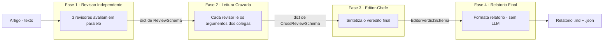

# Pipeline Multiagente Integrado — Peer Review

Repositório **integrado** onde os grupos reúnem suas contribuições para um
**pipeline multiagente em fases**. O caso de teste atual é **peer review** de
artigos científicos, mas a arquitetura foi desenhada para ser **reaproveitável em
outros domínios** (ver [§8 Extensibilidade](#8-extensibilidade)).

O sistema recebe um artigo, faz três revisores especializados avaliarem-no de
forma independente, promove uma leitura cruzada entre eles, sintetiza um veredito
editorial e emite um relatório final — sempre sob **contratos de dados validados**
(schemas Pydantic) com **retry automático** e **bloqueio explícito** de dados
inválidos entre fases.

> Documentação técnica aprofundada dos schemas (tabelas de campos, regras de
> validação e exemplos): [`docs/schema_reference.md`](docs/schema_reference.md).

---

## 1. Visão geral

| | |
|---|---|
| **Objetivo** | Orquestrar agentes em fases sequenciais, com contratos de dados estáveis. |
| **Caso de teste** | Peer review (revisão por pares de um artigo). |
| **Contratos oficiais** | `ReviewSchema`, `CrossReviewSchema`, `EditorVerdictSchema`. |
| **Modos de execução** | **API** (Gemini real) · **Mock** (JSONs locais, offline). |
| **Saída** | Relatório final em Markdown + JSON estruturado. |

Princípio central: a **orquestração é genérica e agnóstica de domínio**
([`src/pipeline_base.py`](src/pipeline_base.py)); a **lógica de peer review**
(agentes, prompts, fases concretas) vive separada ([`src/pipeline.py`](src/pipeline.py)
e os módulos de agentes). Trocar de domínio = escrever novas fases, sem tocar na
orquestração.

### Estrutura do repositório

```
.
├── README.md                    # este arquivo
├── main.py                      # ponto de entrada: roda TODO o pipeline
├── requirements.txt             # dependências Python
├── .env.example                 # template das variáveis de ambiente (modo API)
├── docs/
│   └── schema_reference.md       # documentação técnica detalhada dos schemas
└── src/
    ├── pipeline_base.py          # Orquestração GENÉRICA (Pipeline, PipelinePhase, PipelineContext)
    ├── pipeline.py               # As 4 fases concretas + modos (API/Mock) + demo
    ├── review_schema.py          # Contratos: ReviewSchema, CrossReviewSchema, EditorVerdictSchema
    ├── reviewer_agent.py         # Fase 1 — agentes revisores
    ├── cross_review.py           # Fase 2 — leitura cruzada
    ├── editor_agent.py           # Fase 3 — editor-chefe
    ├── legacy_adapter.py         # Adaptador de formatos legados -> schemas oficiais
    ├── validacao_retry.py        # Grupo 1 — camada de validação, retry e confiabilidade
    ├── demo_validacao.py         # Demo offline da camada de validação (sem API key)
    ├── demo_observabilidade.py   # Grupo 3 — demo offline: roda o pipeline e reconstrói o trace
    ├── observability/            # Grupo 3 — base de observabilidade e traces
    │   ├── events.py             #   formato COMUM de evento (run_id, span_id, phase, author, status)
    │   ├── tracer.py             #   ciclo de vida da execução + spans + storage local (JSONL)
    │   ├── adk_bridge.py         #   captura os Event do Runner do ADK (invocation_id, author, tools)
    │   ├── timeline.py           #   reconstrói a linha do tempo a partir do trace
    │   └── tests/                #   testes offline do tracer (envelope, erro, ponte ADK)
    ├── mocks/                    # Respostas pré-salvas para o modo offline
    │   └── peer_review_mock.json
    └── examples/                 # Artigo de exemplo + exemplos de I/O dos schemas
        ├── example_article.txt
        ├── example_valid_output.json          # ReviewSchema válido
        ├── example_invalid_output.json        # ReviewSchema inválido (viola notas e justificativas)
        ├── example_cross_review_output.json   # CrossReviewSchema válido
        ├── example_invalid_cross_review.json  # CrossReviewSchema inválido (mudou_posicao vs mudancas)
        ├── example_editor_verdict_output.json # EditorVerdictSchema válido
        └── example_invalid_editor_verdict.json # EditorVerdictSchema inválido (decisao, notas)
```

> **Para outros grupos:** a fronteira entre os grupos são os **schemas** de
> [`src/review_schema.py`](src/review_schema.py). Contribua adicionando/encaixando
> lógica nas fases (validação/retry, tools, etc.) sem quebrar esses contratos.

---

## 2. Guia de execução

> Todos os comandos são executados **a partir da raiz do repositório**.

### 2.1 Pré-requisitos

- Python 3.10+
- Dependências:

  ```bash
  pip install -r requirements.txt
  ```

  > O **modo Mock** (offline) precisa apenas de `pydantic` e `python-dotenv`.
  > O **modo API** também precisa de `google-adk` e `google-genai`.

### 2.2 Modo Local / Mock (offline, sem chave) — recomendado para testar o fluxo

Roda as 4 fases lendo respostas pré-salvas de
[`src/mocks/peer_review_mock.json`](src/mocks/peer_review_mock.json). **Não** exige
internet nem `GOOGLE_API_KEY`:

```bash
python main.py mock
```

Equivalente via variável de ambiente:

```bash
# Windows (PowerShell)
$env:PIPELINE_MODE="mock"; python main.py
# Linux / macOS
PIPELINE_MODE=mock python main.py
```

### 2.3 Modo API (chamadas reais ao Gemini)

1. Copie o template e preencha a sua chave:

   ```bash
   cp .env.example .env
   ```

   ```env
   GOOGLE_API_KEY=coloque_sua_chave_real_aqui
   GOOGLE_GENAI_USE_VERTEXAI=FALSE
   GEMINI_MODEL=gemini-2.0-flash
   ```

2. Rode a demo:

   ```bash
   python main.py          # modo api é o default
   # ou explicitamente:
   python main.py api
   ```

   Sem a chave configurada, o modo API interrompe com uma mensagem clara
   (o sistema **não** usa fallback silencioso).

### 2.4 Saídas geradas

Após rodar (em qualquer modo), em `src/outputs/` e `src/logs/` (ignorados pelo git):

| Arquivo | Conteúdo |
|---|---|
| `src/outputs/final_report.md` | Relatório final legível (decisão, síntese, críticas, recomendações). |
| `src/outputs/final_report.json` | Mesmo conteúdo em JSON estruturado, com as saídas de todas as fases. |
| `src/logs/pipeline.log` | Log fase a fase da execução. |
| `src/logs/traces/<run_id>.jsonl` | Trace de observabilidade da execução (um evento por linha) — ver [§7 Observabilidade](#7-observabilidade-e-traces-grupo-3). |

### 2.5 Como escolher o modo (precedência)

1. **Flag** explícita: `python main.py mock` / `run_demo(mode="mock")`;
2. **Variável de ambiente** `PIPELINE_MODE` (`api` / `mock`, com sinônimos `local`, `offline`, `real`);
3. **Default**: `api`.

---

## 3. Arquitetura do pipeline

O pipeline executa **4 fases estritamente sequenciais**. A saída de cada fase é o
**contrato de entrada** da próxima — sempre um schema validado.


```mermaid
flowchart LR
    A[Artigo - texto] --> F1
    subgraph Fase1[Fase 1 · Revisao Independente]
        F1[3 revisores avaliam em paralelo]
    end
    subgraph Fase2[Fase 2 · Leitura Cruzada]
        F2[Cada revisor le os argumentos dos colegas]
    end
    subgraph Fase3[Fase 3 · Editor-Chefe]
        F3[Sintetiza o veredito final]
    end
    subgraph Fase4[Fase 4 · Relatorio Final]
        F4[Formata relatorio - sem LLM]
    end
    F1 -->|dict de ReviewSchema| F2
    F2 -->|dict de CrossReviewSchema| F3
    F3 -->|EditorVerdictSchema| F4
    F4 --> R[Relatorio .md + .json]
```

### As 4 fases

| # | Fase | O que faz | Saída (contrato) |
|---|---|---|---|
| 1 | **Revisão Independente** | Três revisores (estatístico, especialista de domínio, copyeditor) avaliam o artigo **isoladamente**, em 4 critérios + nota geral + confiança. | `dict[id, ReviewSchema]` |
| 2 | **Leitura Cruzada** | Cada revisor lê os **argumentos** (não as notas) dos colegas e decide manter ou revisar a sua posição, de forma rastreável. | `dict[id, CrossReviewSchema]` |
| 3 | **Editor-Chefe** | Sintetiza os pareceres finais em uma **decisão editorial única**, preservando todas as críticas. | `EditorVerdictSchema` |
| 4 | **Relatório Final** | Consolida tudo num relatório legível + JSON. Pura formatação, **sem LLM**. | `FinalReport` (md + dados) |

### Os schemas como contratos

Os três schemas vivem em [`src/review_schema.py`](src/review_schema.py) e são a
**única fonte de verdade** do formato de dados. Toda fase **valida** sua
entrada/saída contra eles — inclusive no modo Mock —, então um dado malformado
falha cedo e de forma explícita, em vez de se propagar silenciosamente.

- **`ReviewSchema`** (Fase 1) — parecer de um revisor: 4 critérios
  (`solidez_tecnica`, `originalidade`, `significancia`, `clareza`), cada um com
  **nota (1–4) + justificativa obrigatória**, mais `nota_geral` (1–4) e
  `confianca` (1–3). Notas fora da faixa, justificativas vazias e campos extras
  são **rejeitados**.
- **`CrossReviewSchema`** (Fase 2) — embute o parecer revisado (`ReviewSchema`) e
  registra, de forma rastreável, se houve mudança de posição (`mudou_posicao`),
  **quais** notas mudaram (`mudancas`) e **qual argumento** foi decisivo.
- **`EditorVerdictSchema`** (Fase 3) — a `decisao` usa a **mesma escala 1–4** da
  `nota_geral` (sem formato paralelo de nota), com `sintese`, `justificativa`,
  `notas_por_revisor`, `criticas` (cada fraqueza/crítica preservada) e
  `recomendacoes_aos_autores`.

> **Sem formatos paralelos.** Escalas e vocabulários legados (ex.: notas 0–10 e
> rótulos "Accept/Minor Revision") só entram no sistema através do adaptador
> documentado [`src/legacy_adapter.py`](src/legacy_adapter.py), que converte e
> **revalida** contra os schemas oficiais.

### Camada de orquestração (genérica)

[`src/pipeline_base.py`](src/pipeline_base.py) não conhece peer review. Ele fornece:

- `PipelinePhase[TIn, TOut]` — fase tipada (contrato entrada→saída explícito);
- `Pipeline` — encadeia fases, propaga a saída de uma para a próxima e acumula
  todos os artefatos;
- `PipelineContext` — carrega a entrada original e as saídas já produzidas, para
  que fases posteriores (ex.: o relatório) consultem fases anteriores.

---

## 4. Validação, Retry e Confiabilidade (Grupo 1)

A camada de validação/retry foi integrada ao pipeline pelo Grupo 1. O módulo
central é [`src/validacao_retry.py`](src/validacao_retry.py).

### Como funciona

Após cada agente produzir uma saída, o pipeline chama `validar_com_tentativas()`
antes de passar o dado para a próxima fase. Essa função:

1. **Tentativa 1** — valida o dado bruto contra o schema oficial (Pydantic).
   Se passar, retorna imediatamente.
2. **Tentativas 2–N** — aplica um corrector automático e tenta validar novamente.
   Cada tentativa é registrada no histórico.
3. **Esgotamento** — se todas as tentativas falharem, levanta
   `PipelineValidationError`. O dado **nunca passa silenciosamente** para a
   próxima fase.

```
Saída bruta do agente
        |
        v
validar_com_tentativas()
  tentativa 1: schema_fn(dados)   ------> OK? retorna resultado
  tentativa 2: corrector(dados) -> schema_fn(dados)  --> OK? retorna
  tentativa 3: corrector(dados) -> schema_fn(dados)  --> OK? retorna
        |
        v  (todas falharam)
PipelineValidationError (pipeline bloqueado)
```

### Comportamento de falha definido

| Comportamento | Implementação |
|---|---|
| **Retry** | Até `MAX_TENTATIVAS = 3` vezes por agente |
| **Registro de erro** | `ResultadoValidacao.historico` — uma entrada por tentativa com status e mensagem |
| **Bloqueio** | `PipelineValidationError(RuntimeError)` — impede propagação silenciosa |
| **Marcação para revisão humana** | O chamador pode capturar `PipelineValidationError` e registrar o `ResultadoValidacao` completo para triagem manual |

### Correctors (quem conserta o dado antes do retry)

| Modo | Corrector | Descrição |
|---|---|---|
| `mock` | `corrigir_saida_mock()` | Determinístico, offline, sem API key. Clampeia notas fora do range, injeta sentinel em campos vazios/ausentes, corrige incoerências `mudou_posicao/mudancas`. |
| `api` | `corrigir_saida_api()` | Chama o Gemini com o JSON inválido + erro Pydantic + JSON Schema esperado e pede a correção. Importação lazy — não quebra o modo offline. |

### Pontos de integração no pipeline

A função `validar_com_tentativas()` substitui as chamadas diretas a
`validar_*()` nas **6 fronteiras de fase** de [`src/pipeline.py`](src/pipeline.py):

| Fase | Schema validado | Agentes cobertos |
|---|---|---|
| Fase 1 — Revisão Independente | `ReviewSchema` | `statistician`, `domain_expert`, `copyeditor` |
| Fase 2 — Leitura Cruzada | `CrossReviewSchema` | `statistician`, `domain_expert`, `copyeditor` |
| Fase 3 — Editor-Chefe | `EditorVerdictSchema` | `editor` |

### Demo offline

Roda **sem internet e sem `GOOGLE_API_KEY`**, demonstrando os 4 requisitos da spec:

```bash
python src/demo_validacao.py
```

| Cenário | O que demonstra |
|---|---|
| 1 | Parecer válido (`ReviewSchema`) passando na tentativa 1 |
| 2 | Parecer inválido falhando com mensagem clara por campo |
| 3 | Retry: tentativa 1 falha, corrector mock repara, tentativa 2 passa |
| 4 | Esgotamento: `PipelineValidationError` capturada com histórico de 3 tentativas |
| 5–6 | `CrossReviewSchema` válido e inválido |
| 7–8 | `EditorVerdictSchema` válido e inválido |
| 9 | Diagrama dos 6 pontos de integração no pipeline |

### Exemplos versionados de JSON inválido

| Arquivo | Schema | Violações documentadas |
|---|---|---|
| [`example_invalid_output.json`](src/examples/example_invalid_output.json) | `ReviewSchema` | `nota=5` (acima do máximo), `justificativa` só espaços, `confianca.nota=0` |
| [`example_invalid_cross_review.json`](src/examples/example_invalid_cross_review.json) | `CrossReviewSchema` | `mudou_posicao=true` com `mudancas=[]`, `resposta_aos_pares` vazia |
| [`example_invalid_editor_verdict.json`](src/examples/example_invalid_editor_verdict.json) | `EditorVerdictSchema` | `decisao=5`, `justificativa=""`, `notas_por_revisor={}`, recomendação vazia |

---

## 5. Tools Determinísticas de Auditoria (Grupo 2)

Tools **sem LLM** que auditam os schemas oficiais do pipeline. Vivem em
[`src/tools/`](src/tools/) e operam sobre `dict` puro, usando apenas a
biblioteca padrão — rodam offline em clone limpo.

### As três tools

| Tool | Arquivo | O que faz | Quando é chamada |
|---|---|---|---|
| `validar_completude` | [`tools/validar_completude.py`](src/tools/validar_completude.py) | Audita a **estrutura** de um parecer (`ReviewSchema`) ou veredito (`EditorVerdictSchema`): detecta campos faltando, notas fora da faixa e justificativas vazias; devolve `score_completude` (0–1). | **Fase 1** — após cada parecer de revisor ser validado pelo schema Pydantic. |
| `checar_coerencia` | [`tools/checar_coerencia.py`](src/tools/checar_coerencia.py) | Detecta **inconsistências semânticas** no veredito (ex.: `decisao=4` com notas baixas; crítica bloqueante junto de aceitação; crítica de revisor sem nota). | **Fase 3** — chamada por dentro de `auditar_decisao_final`, que herda as inconsistências detectadas. |
| `auditar_decisao_final` | [`tools/auditar_decisao_final.py`](src/tools/auditar_decisao_final.py) | Produz um **log de auditoria rastreável** do veredito do editor: agrega notas, conta críticas, herda inconsistências de `checar_coerencia` e decide `requer_revisao_humana`. | **Fase 3** — logo após o veredito ser validado, antes de passar à Fase 4. |

### Pontos de integração no pipeline

```
Fase 1 · Revisão Independente
  └─ para cada revisor: validar_completude(parecer)
        → loga score_completude e flag completo

Fase 3 · Editor-Chefe
  └─ auditar_decisao_final(veredito)
        → loga resumo_auditoria
        → avisa se requer_revisao_humana = True
        → inclui resultado em final_report.json["auditoria_veredito"]
```

As importações são **guardadas**: se um arquivo de tool ainda não existir, o
pipeline continua sem ela (registra apenas a ausência no log).

### Demo offline das tools

Roda **sem internet e sem `GOOGLE_API_KEY`**, mostrando as três tools sobre
exemplos versionados:

```bash
python src/tools/demo_tools.py
```

| Cenário | O que demonstra |
|---|---|
| 1 | `validar_completude` em parecer válido (`ReviewSchema`) — `score=1.0` |
| 2 | `validar_completude` detectando campos faltando e notas inválidas |
| 3 | `validar_completude` no veredito incompleto (`EditorVerdictSchema`) |
| 4 | `checar_coerencia` detectando 3 inconsistências simultâneas no veredito incoerente |
| 5 | `auditar_decisao_final` sobre o veredito versionado |

### Exemplos versionados de JSON para as tools

| Arquivo | Usado por |
|---|---|
| [`example_valid_output.json`](src/examples/example_valid_output.json) | `validar_completude` — parecer válido (score 1.0) |
| [`example_parecer_incompleto.json`](src/examples/example_parecer_incompleto.json) | `validar_completude` — campo faltando + notas inválidas |
| [`example_veredito_incompleto.json`](src/examples/example_veredito_incompleto.json) | `validar_completude` — veredito com sintese/notas inválidas |
| [`example_editor_verdict_output.json`](src/examples/example_editor_verdict_output.json) | `auditar_decisao_final` — veredito coerente (score ok) |
| [`example_editor_verdict_incoerente.json`](src/examples/example_editor_verdict_incoerente.json) | `checar_coerencia` / `auditar_decisao_final` — 3 inconsistências simultâneas |

### Testes

```bash
# Todos os testes das tools (33 no total, 100% passando)
.venv/bin/pytest src/tools/tests/ -v
```

---

## 6. Mocks atuais (o que ainda está mockado)

Seção transparente sobre o que **não** é "real" hoje:

| Item | Situação |
|---|---|
| **Fases 1–3 no modo Mock** | Lidas de [`src/mocks/peer_review_mock.json`](src/mocks/peer_review_mock.json). No modo API, são chamadas reais ao Gemini. |
| **Fase 4 (relatório)** | **Nunca** mockada — é pura formatação em Python, idêntica nos dois modos. |
| **Entrada do artigo** | Usa um `.txt` de exemplo ([`src/examples/example_article.txt`](src/examples/example_article.txt)). **Ainda não há** ingestão/parse de PDF. |
| **Validação & retry** | **Integrado** — ver [§4](#4-validação-retry-e-confiabilidade-grupo-1). Retry automático com corrector em modo Mock (offline) e API (Gemini). `PipelineValidationError` bloqueia propagação de dados inválidos. |
| **Tools de auditoria** | **Integradas** — ver [§5](#5-tools-determinísticas-de-auditoria-grupo-2). `validar_completude` (Fase 1), `checar_coerencia` (chamada por dentro da Fase 3) e `auditar_decisao_final` (Fase 3) — todas ativas. |
| **Adaptação de pareceres legados de revisor** | O [`src/legacy_adapter.py`](src/legacy_adapter.py) converte o **veredito do editor** legado; o parecer **de revisor** legado não tem as 4 dimensões e, por isso, **não** é adaptado automaticamente (exige nova revisão — limitação documentada). |

> O conteúdo do JSON de mock é **fictício**, porém **válido** contra os schemas —
> incluindo um caso realista em que o `domain_expert` muda de posição na leitura
> cruzada. Isso garante que o fluxo offline exercite os mesmos contratos do fluxo
> real.

---

## 7. Observabilidade e Traces (Grupo 3)

Base de observabilidade próxima do padrão **Google ADK** (eventos, sessões,
traces). Responde à pergunta **"por onde a execução passou?"**: ao final de uma
run é possível reconstruir, em ordem, quais fases rodaram, quais agentes
participaram, o que deu certo, onde houve alerta e quais arquivos foram gerados.
Vive em [`src/observability/`](src/observability) e é **aditiva** — não altera
validação/retry (Grupo 1) nem as tools (Grupo 2).

### Como rodar a demo (offline, sem chave)

```bash
python src/demo_observabilidade.py        # roda o pipeline em mock e imprime o trace
```

A demo executa o pipeline completo e, ao final, **reconstrói a linha do tempo**
a partir do trace gravado. Também é gerado automaticamente em qualquer
`python main.py mock|api`.

> Um trace de exemplo (uma execução em modo mock, 25 eventos) está versionado em
> [`src/examples/example_trace.jsonl`](src/examples/example_trace.jsonl) — útil
> para inspecionar o formato sem precisar rodar. Os traces reais gerados em
> `src/logs/traces/<run_id>.jsonl` continuam **ignorados pelo git** (artefatos).

### O formato comum de evento

Todo evento usa o mesmo `TraceEvent` ([`events.py`](src/observability/events.py)),
com os campos que respondem às perguntas exigidas:

| Campo | Responde |
|---|---|
| `run_id` | a QUAL execução pertence |
| `invocation_id` | vínculo com a invocação do **ADK** (quando há chamada real) |
| `phase` | em QUAL fase ocorreu |
| `author` | QUEM gerou (agente, `grupo1`, `grupo2`, `sistema`) |
| `status` | `ok` / `alerta` / `erro` / `em_andamento` |
| `span_id` / `parent_span_id` | a HIERARQUIA de spans (run → fase) |
| `kind` | o PAPEL do evento/span (`run`/`phase`/`agent`/`tool`/`report`) |
| `attributes` | espaço livre para cada grupo anexar seus dados |

> **Sobre a hierarquia:** hoje apenas a execução (`run`) e as fases viram *spans*
> com início/fim, duração e `parent_span_id`. Agente, tool e relatório entram como
> **eventos pontuais tipados** (via `kind`) ancorados no span da fase corrente —
> não como spans aninhados. O `SpanKind` enumera todos esses papéis; transformar
> agente/tool em spans reais é uma evolução natural, sem mudar o formato do evento.

### Como entender o trace gerado

A reconstrução imprime a árvore da execução, por exemplo:

```
✓ <run> peer_review [7 ms]
  ✓ <phase> fase_1_revisao_independente [2 ms]
    · ✓ parecer_validado [statistician] — tentativas=1, validado_por=grupo1
    · ✓ completude [grupo2] — revisor=statistician, score=1.0, completo=True
  ✓ <phase> fase_2_leitura_cruzada [1 ms]
    · ✓ leitura_cruzada_concluida [sistema] — mudaram_de_posicao=['domain_expert']
  ✓ <phase> fase_3_editor_chefe [0 ms]
    · ✓ auditoria_veredito [grupo2] — requer_revisao_humana=False
  ✓ <phase> fase_4_relatorio_final [1 ms]
```

O `final_report.json` passa a carregar o `run_id` que o gerou — o relatório
**aponta para a execução** que o produziu.

### Como os outros grupos entram na MESMA execução

Uma linha, sem acoplamento (no-op fora de uma execução):

```python
from observability import emit_event
emit_event("validacao_ok", author="grupo1", attributes={"tentativas": 1})
```

### Decisões de projeto (curtas)

- **Instrumentação aditiva e à prova de falhas.** O tracer é opcional e engole
  os próprios erros: se a observabilidade falhar, o pipeline continua rodando
  (mesma política de importação guardada do Grupo 2). A demo básica não trava.
- **Storage local agora, OpenTelemetry depois.** Grava JSONL local atrás de uma
  interface `Exporter` trocável — os campos (`span_id`/`parent_span_id`/
  `attributes`) mapeiam direto em spans OTel, então trocar para Cloud Trace/
  Langfuse é plugar um exporter, sem reescrever o núcleo.
- **Captura de eventos do ADK.** O consumo de `runner.run_async` que antes
  descartava os eventos (`pass`) agora passa cada `Event` por
  [`adk_bridge.py`](src/observability/adk_bridge.py), preservando `invocation_id`
  e `author`.

### Testes

Suíte offline em [`src/observability/tests/`](src/observability/tests/) — usa o
`MemoryExporter` (eventos em memória), então roda **sem chave e sem tocar o disco**:

```bash
.venv/bin/python -m pytest src/observability/tests/ -v
```

Cobre os pontos que a demo em modo mock não exercita:

- **Envelope e hierarquia:** `run_start` → 4 spans de fase → `run_end`, cada fase
  filha do `run` via `parent_span_id`, sem span pendurado.
- **Caminho de erro:** uma exceção numa fase vira evento `error`, marca span e
  execução como `erro` e é re-levantada; e a falha do `Exporter` **não** derruba o
  pipeline (a decisão de projeto acima, agora verificada).
- **Captura do ADK sem API:** um `Event` falso passa por `trace_adk_event` e
  confirma-se que `author`, `invocation_id` e as tool calls são preservados —
  validando a ponte ADK offline, sem o Runner real.

---

## 8. Extensibilidade

A separação **orquestração × domínio** permite reusar a mesma arquitetura de 4
fases em outros problemas multiagentes. A receita conceitual:

1. **Defina os contratos do novo domínio.** Crie schemas Pydantic análogos aos
   três atuais — um por fase. Eles são o "idioma" que as fases falam entre si.
2. **Implemente as fases concretas.** Para cada fase, escreva uma subclasse de
   `PipelinePhase[Entrada, Saída]` que produz/valida o schema correspondente. A
   lógica interna (quais agentes/prompts/ferramentas usar) é livre.
3. **Monte o pipeline.** Liste as fases na ordem desejada num `Pipeline(...)`. A
   orquestração, o encadeamento e a propagação de contexto já vêm prontos de
   [`src/pipeline_base.py`](src/pipeline_base.py) — **sem alterações**.
4. **Reaproveite o modo Mock.** O mesmo padrão de "ler JSON pré-salvo e validar
   pelo schema" dá a você execução offline desde o primeiro dia.

### Exemplos de outros domínios

A estrutura "**múltiplos pareceres independentes → reconciliação → decisão →
relatório**" é genérica. Ela se aplica, por exemplo, a:

- **Triagem de currículos**: avaliadores especializados (técnico, cultural, de
  senioridade) → reconciliação → decisão de avanço → relatório ao recrutador.
- **Moderação de conteúdo**: classificadores por política (spam, toxicidade,
  direitos autorais) → leitura cruzada → veredito de moderação → log de auditoria.
- **Diligência de relatórios financeiros**: analistas (risco, contábil,
  regulatório) → reconciliação → recomendação → memorando.
- **Avaliação de propostas/grants**: revisores por eixo (mérito, viabilidade,
  impacto) → debate → decisão de financiamento → parecer.

Em todos, **só mudam os schemas e a lógica das fases**; a espinha dorsal de
orquestração, a alternância API/Mock e o padrão de validação permanecem os
mesmos.

---

## Apêndice — comandos rápidos

```bash
# Fluxo completo offline (sem chave):
python main.py mock

# Fluxo completo com Gemini real (requer .env com GOOGLE_API_KEY):
python main.py api

# Demo offline das tools de auditoria do Grupo 2 (sem API key):
python src/tools/demo_tools.py

# Demo offline da camada de validação/retry do Grupo 1 (sem API key):
python src/demo_validacao.py

# Demo offline da observabilidade/traces do Grupo 3 (sem API key):
python src/demo_observabilidade.py

# Testes das tools (Grupo 2):
.venv/bin/pytest src/tools/tests/ -v

# Testes da observabilidade (Grupo 3):
.venv/bin/python -m pytest src/observability/tests/ -v

# Demos isoladas de fases específicas (usam a API real):
python src/reviewer_agent.py     # apenas a Fase 1 (avaliação independente)
python src/cross_review.py       # Fase 1 + Fase 2 (leitura cruzada)
```

> As demos isoladas (`reviewer_agent.py`, `cross_review.py`) usam a API real e
> exigem `GOOGLE_API_KEY`. Para um passo a passo offline de ponta a ponta, use
> `python main.py mock`.
